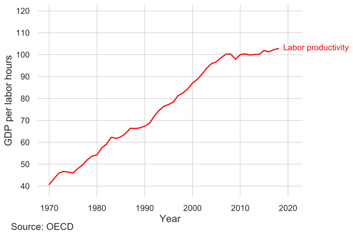
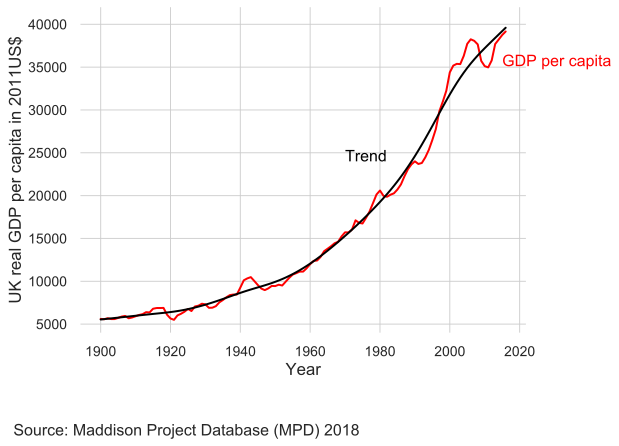
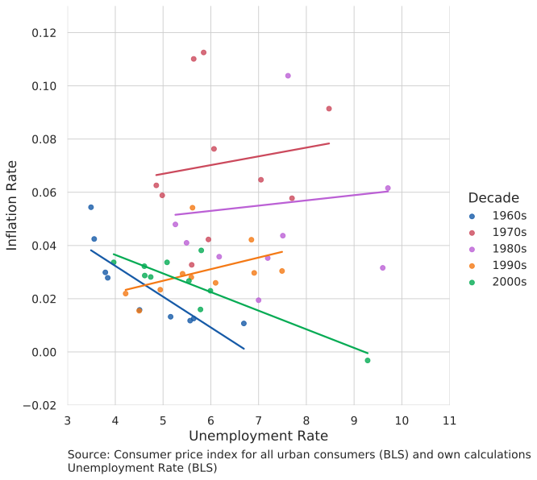
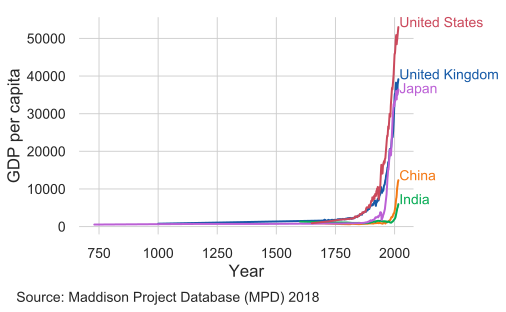
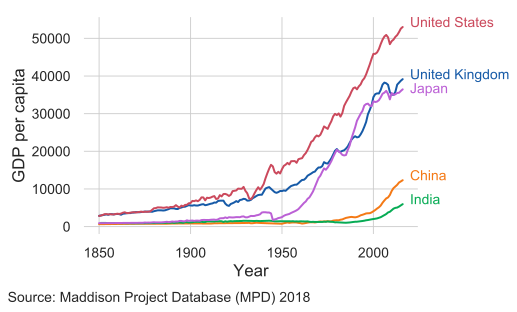

```{r setup, include=FALSE}
options(htmltools.dir.version = FALSE)
library(knitr)
opts_chunk$set(
  fig.align="center", ##fig.width=6, fig.height=4.5, 
  ## out.width="748px", ##out.length="520.75px",
  dpi=300, ##fig.path='Figs/',
  cache=T##, echo=F, warning=F, message=F
  )
```
## Welcome back!

<center>

</center>


---
## EC566: Macroeconomics for Business

<br>

<br>

- &#x130;lhan G&#252;ner

- **Office**: Kennedy 119

- **Consultation hours**: Mondays and Wednesdays 10-11am

- **E-mail:** i.guner@kent.ac.uk

---

## Assessment

- 20% Coursework

 - 2 short essays (10% each)

- 80% 2hr exam

### Coursework essay submissions:

- Week 19

- Week 24

---

## Coursework Essay - Guidelines

- 750 word limit – 10% allowance in excess of word limit is permitted

- Structure: Brief introduction, main body, brief conclusion

- Include a bibliography (does not count in word count)

- For more information here is a good starting point:
https://www.kent.ac.uk/learning/resources/studyguides/planningandwritingessays.pdf

#### Assessment is electronic only:
 - Submit via turnitin

 - Try to avoid high similarity scores
 
 - Use sensibly sized font (e.g.12pt)
 
- Draw diagrams where relevant

---

## Coursework Essays - Topics 

<br>

- The lists of essay topics will be available in Moodle

- One essay to be chosen out of four topics in Week 19 

 - List of topics is available immediately

- One essay to be chosen out of three topics in Week 24

 - List will be made available in week 19.

- Start thinking and preparing early

- Get consultation and guidance  - make use of my office hours

---

## Key factors for success:


<br>


- Read the core text: [Core The Economy](https://core-econ.org/the-economy/?lang=en) 

 - In addition to core text, you may also use additional recommended text books

- Prepare for seminars – Use them to test your understanding of the lecture


- Read a good daily newspaper  - The New York Times, Financial Times, Economist

 - The library provides online [access](https://www.kent.ac.uk/library/resources/news/index.html) to NYT and FT.

---

class: inverse, center, middle
name: lect

# Overview

<html><div style='float:left'></div><hr color='#EB811B' size=1px width=796px></html>

---


## Topics

.pull-left[

- Microeconomics review

 - Labor discipline model- Unit [6.6](https://core-econ.org/the-economy/book/text/06.html#66-work-and-wages-the-labour-discipline-model), [6.7](https://core-econ.org/the-economy/book/text/06.html#67-wages-effort-and-profits-in-the-labour-discipline-model)
 
 - Price setting firms- Unit [7](https://core-econ.org/the-economy/book/text/07.html)
 
 - Supply and demand – Unit [8](https://core-econ.org/the-economy/book/text/08.html)
 
- The labor market – Unit [9](https://core-econ.org/the-economy/book/text/09.html)

- Banks, money and the credit market – Unit [10](https://core-econ.org/the-economy/book/text/10.html)

- Economic fluctuations - Unit [13](https://core-econ.org/the-economy/book/text/13.html)

- Fiscal policy – Unit [14](https://core-econ.org/the-economy/book/text/14.html)

- Monetary policy – Unit [15](https://core-econ.org/the-economy/book/text/15.html)

- Long-run economic performance – Unit [16](https://core-econ.org/the-economy/book/text/16.html)

- International trade and globalization – Unit [18](https://core-econ.org/the-economy/book/text/18.html)
]

.pull-right[
#### If time permits, we will cover a selection of
- Economic inequality – Unit [19](https://core-econ.org/the-economy/book/text/19.html)

- Economics of the environment – Unit [20](https://core-econ.org/the-economy/book/text/20.html)

- Markets, efficiency, and public policy – Unit [12](https://core-econ.org/the-economy/book/text/12.html)

- Innovation, information, and the networked economy – Unit [21](https://core-econ.org/the-economy/book/text/21.html)

- The Great Depression – Unit [17](https://core-econ.org/the-economy/book/text/17.html)

]
---
### Microeconomics review 

<br>


We will learn

- how wages are determined within a firm,

- how prices are set when a firm has a price setting power,

- how prices are determined when each individual firm and each consumer has no power to set prices. 
---
### The labor market

<br>

We will learn

- economy wide determination of wages, employment, and the distribution of income 

- how wages and unemployment rate are related

- how wage setting and price setting processes jointy determine real wages and the level of unemployment in the economy


---
### Unemployment rate

<center>
<iframe src="https://fred.stlouisfed.org/graph/graph-landing.php?g=pRUY&width=950&height=475" scrolling="no" frameborder="0"style="overflow:hidden; width:950px; height:525px;" allowTransparency="true" loading="lazy"></iframe>
</center>

---
### Real wages

<center>

</center>

Wait! How come unemployment rate is at record-low levels but real wages remain below pre-crisis level?

---
### Productivity in the UK

<center>

</center>

---
### Lost Income

<center>

</center>

Had the productivity growth followed the trend, each person would have earned about 11% more now.
---
### The credit market

We will learn

- role of financial institutions on funneling consumer savings into investment

- principal agent problem in the borrowing-lending relationship

- the process of money creation

- the role of central banks

- determination of the interest rate charged by the banks

 - largely determined by the policy rate set by the central banks

---
### Deposit rate
<center>
<iframe src="https://fred.stlouisfed.org/graph/graph-landing.php?g=pSS5&width=950&height=475" scrolling="no" frameborder="0"style="overflow:hidden; width:950px; height:525px;" allowTransparency="true" loading="lazy"></iframe>
</center>


---
### Monetary Policy

<center>
<iframe src="https://fred.stlouisfed.org/graph/graph-landing.php?g=oHnd&width=950&height=475" scrolling="no" frameborder="0"style="overflow:hidden; width:950px; height:525px;" allowTransparency="true" loading="lazy"></iframe>
</center>

---

### Economic fluctuations


<center>

</center>

---
### Economic fluctuations

<center>

</center>

---
### Business Cycles

.pull-left[
#### Trend
<center>

</center>

]

.pull-right[
#### Cycle
<center>

</center>

]


---
### Fiscal Policy
<center>

</center>


---
### Philips Curve

<center>

</center>

---

### Philips Curve

<center>

</center>


---

### Philips Curve

<center>

</center>

---
### Philips Curve

<center>

</center>

---
### Philips Curve

<center>

</center>

---
### Philips Curve

<center>

</center>

---
### Measuring income and living standards

<br>

<br>


- Gross Domestic Product (GDP) = A measure of total income and output of the economy in a given period.
Usually expressed in per-capita terms (as an average income).

- GDP per capita ≠ Disposable income

- Disposable income = Total income – taxes + government transfers

- Both are imperfect measures of well-being


---
### GDP per capita over time

<center>

</center>

---

### Timing of growth


<br>


- Growth take-off occurred at different points in time for different countries:

 - Britain was the first country to experience sustained economic growth. It began around 1650.
 
 - In Japan, it occurred around 1870.
 
 - The kink for China and India happened in the second half of the 20th century. 

- In some economies, substantial improvements in people’s living standards did not occur until they gained independence from colonial rule or interference by European nations.


---
### Britain: first to sustained economic growth

<center>

</center>

---
### Sustained growth in Japan occurred around 1870

<center>

</center>

---
### The kink for China and India happened in the second half of the 20th century

<center>

</center>

---

### Income as a measure of well-being

<center>
<iframe src="./lecture1_files/figure-html/gapminder.html" scrolling="no" style="width: 100%; height: 500px; border: 0px none;"></iframe>
</center>

Data: Gapminder
---
### International trade
<center>

<iframe src="https://ourworldindata.org/grapher/merchandise-exports-gdp-cepii?time=1827..2014&country=OWID_WRL" style="width: 80%; height: 500px; border: 0px none;"></iframe>

</center>
---

class: inverse, center, middle
name: other

# If time remains...

<html><div style='float:left'></div><hr color='#EB811B' size=1px width=796px></html>

---


.pull-left[
### Income Inequality

- Inequality in the world has been decreasing

- Inequality in the advanced economies have been increasing

]

.pull-right[

]

  
---
### Markets, efficiency, and public policy 
<center>

</center>


---
### Economics of environment
<center>
<iframe src="https://ourworldindata.org/grapher/co2-concentration-long-term" style="width: 80%; height: 500px; border: 0px none;"></iframe>
</center>

---
### Next lecture

We will discuss

- wage setting process of firms
