```{r setup, include=FALSE}
options(htmltools.dir.version = FALSE)
library(knitr)
opts_chunk$set(
  fig.align="center", ##fig.width=6, fig.height=4.5, 
  ## out.width="748px", ##out.length="520.75px",
  dpi=300, ##fig.path='Figs/',
  cache=T##, echo=F, warning=F, message=F
  )
```

## Employment Rents

.pull-left[
- Cost of loosing a job

 - The difference between value of job and the next best option

- Depends on  
 - wage, medical benefits, ... 
 - disutility of work (function of effort),
 - unemployment benefits (if exists)
 - duration of potential unemployment
 - stigma of unemployment,
 - other available employment opportunities  

- Reservation wage = value of next best option

- Employment rent = wage - reservation wage - distutility of effort
]

.pull-right[

<center>
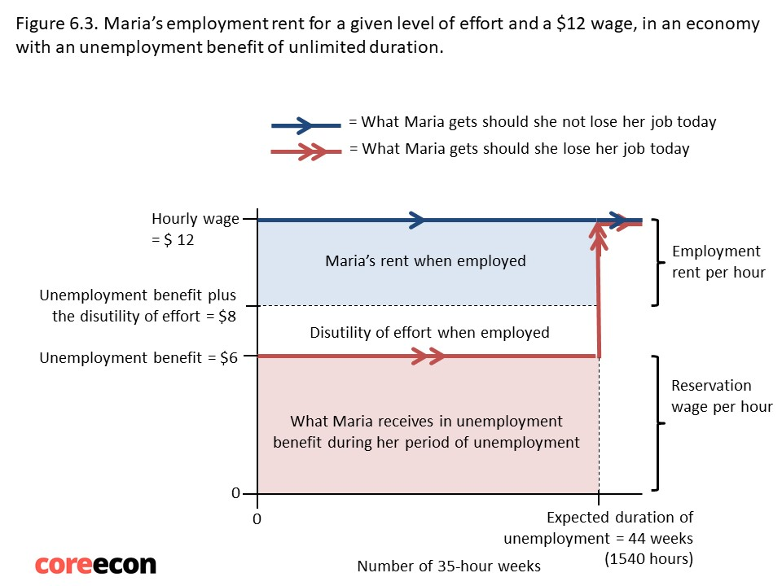
</center>

Employment rent = $(12-2-6) \times 35 \times 44 = 6160$ 

]
---

class: inverse, center, middle
name: labor_discipline

# Labor Discipline Model

<html><div style='float:left'></div><hr color='#EB811B' size=1px width=796px></html>

---

## Worker's best response

.pull-left[
- For a given wage offered, the optimal effort exerted by the workers

- Say wage rate = $12
 - Why would'nt a worker exert more effort than .5?
 - Why would'nt a worker exert less effort than .5?
 
- Feasible set: 

 - Wage and effort pairs that a firm can get from its employees

- Slope of the best response curve = MRT
 - MRT stands for marginal rate of transformation
]
.pull-right[
<center>
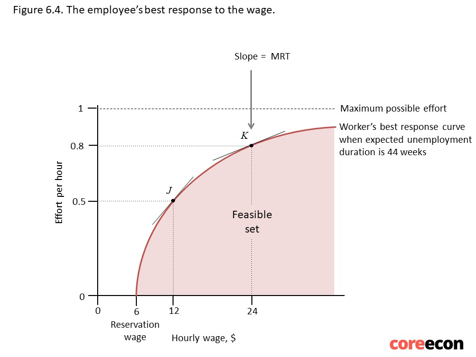
</center>
]

---

## Shape of worker's best response

.pull-left[
- Effort at the reservation wage is 0

- Effort is increasing in wage

- Best response function is concave

 - Firms need to increase wage rate more to induce more effort from workers if the initial wage is higher

- For more detail read [Leibniz: The worker’s best response function](https://www.core-econ.org/the-economy/book/text/leibniz-06-06-01.html)

Questions:

- What happens to the best response curve if 

 - unemployment duration increases,
 
 - unemployment benefit decreases?
]


.pull-right[
<center>

</center>
]

---
## Firm's best response

- A firm's goal is to maximize profits

 - Maximize production
 
 - Minimize cost
 
- To maximize production, offer higher wages

 - $\Uparrow$ wages $\Rightarrow$ $\Uparrow$ effort $\Rightarrow$ $\Uparrow$ production

- To minimize cost, offer lower wages

- Trade-off between wages and effort
---
## Isocost lines

.pull-left[

#### How to deal with the wage effort trade-off?

- Minimize cost of effort (effort/wage)

- Cost of effort is the same at all points on an isocost line


]
.pull-right[

<br>

<center>

</center>
]

---
## Isocost lines

.pull-left[

#### How to deal with the wage effort trade-off?

- Minimize cost of effort (effort/wage)

- Cost of effort is the same at all points on an isocost line

 
- Cost of effort goes down as the isocosts shifts up

]
.pull-right[

<br>

<center>

</center>
]

---
## Isocost lines

.pull-left[

#### How to deal with the wage effort trade-off?

- Minimize cost of effort (effort/wage)

- Cost of effort is the same at all points on an isocost line

- Cost of effort goes down as the isocosts shifts up

- Slope of isocost curve is MRS

 - MRS: marginal rate of substitution 
 

]
.pull-right[

<br>

<center>

</center>
]

---
## Determination of wages

.pull-left[
- Profits are maximized at the steepest isocost line at the minimum feasible cost
 
 - Equilibrium wage and effort is point A, where MRS = MRT

- Efficiency wage: a wage rate greater than the reservation wage rate
]
.pull-right[
<center>
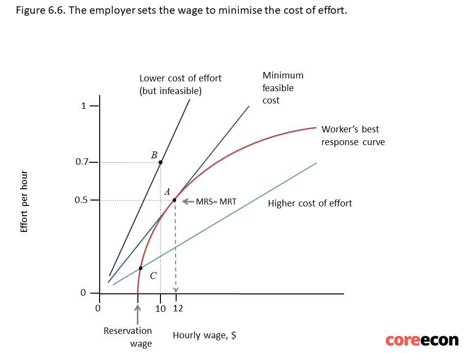
</center>
]

---

.pull-left[
#### Trend
]
.pull-right[
<br>
<br>
<center>
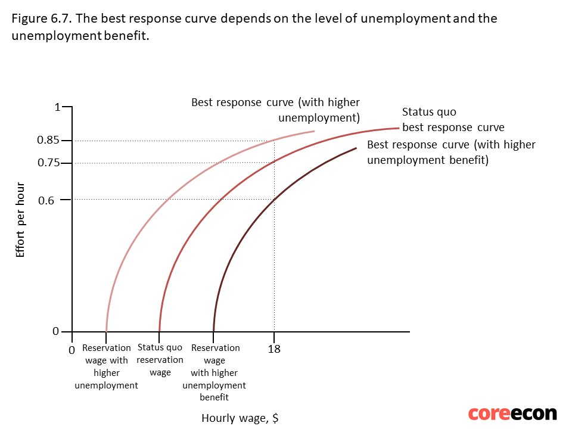
</center>
]


---

class: inverse, center, middle
name: price_setting

# Price Setting Firms

<html><div style='float:left'></div><hr color='#EB811B' size=1px width=796px></html>

---

## Firm decisions
.pull-left[

- What to produce

- How to produce

- Wages 

- Advertising budget

- R&D budget

- _How much to produce_

- _At what price to sell_

- ...
]

.pull-right[
<center>

</center>
Source: New Yorker

]
---
## Pricing and production decisions

- Relevant for firms selling differentiated products or firms with market power?

 - More on this later
 
 
- Depends on

 - Cost structure

 - Market demand
 
- Analyze pricing and production decisions

 1. Represent cost structure as cost function
 
 2. Using cost function, draw isocost curves
 
 3. Repersent market demands as demand function
 
 4. Using isocost curves and market demand, find the profit maximizing price and output combination

---
## Cost Structure

### Understanding economies of scale

- Increasing returns to scale (Economies of scale):

 - $xF(K,AL) < F(xK,xAL)$

 - If inputs increase by a given proportion, output increases more than proportionally

- Constant returns to scale:

 - $xF(K,AL) = F(xK,xAL)$

 - If inputs increase by a given proportion, output increases proportionally
 
- Decreasing returns to scale (Diseconomies of scale):

 - $xF(K,AL) > F(xK,xAL)$

 - If inputs increase by a given proportion, output increases less than proportionally

---
## Economies of scale


.pull-left[
Potential causes

- Fixed cost of production

- Learning by doing

- Greater bargaining power

- Network effects


## Diseconomies of scale

Potential causes

- Additional layer of bureaucracy

- Harder to minotor employees

- Necessity of other departments

]

.pull-right[
<center>

</center>
Source: New Yorker

]

---
### Total cost of production and average cost of production

.pull-left[
- Total cost of production, $C(Q)$:

 - total cost of producing $Q$ amount of output

- Average cost of production = $C(Q)/Q$

]

.pull-right[

<center>
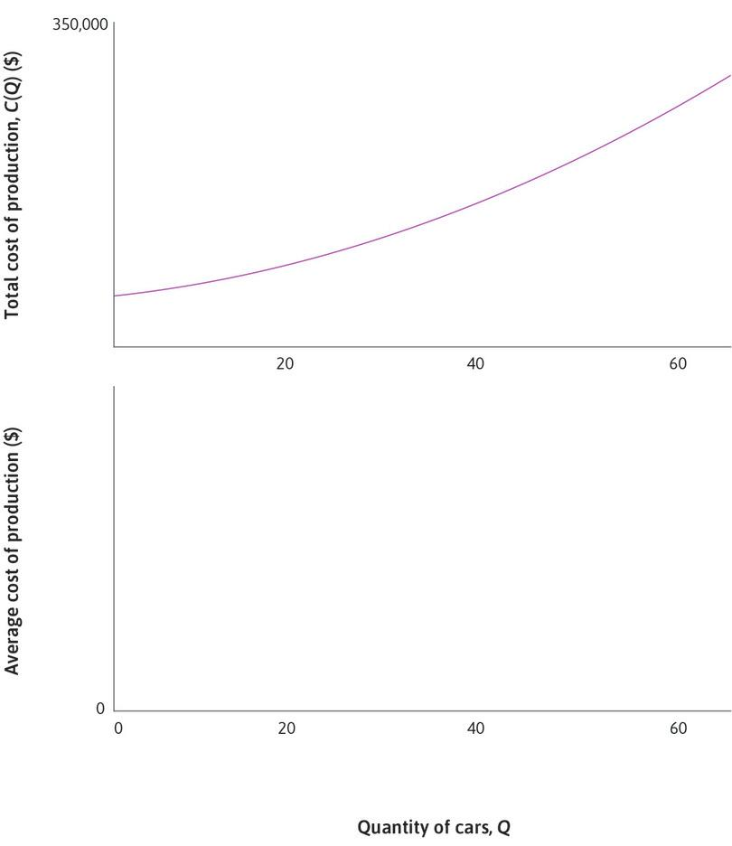
</center>
]

---

### Total cost of production and average cost of production

.pull-left[
- Total cost of production, $C(Q)$:

 - total cost of producing $Q$ amount of output

- Average cost of production = $C(Q)/Q$

- $F:$ fixed cost of production

]

.pull-right[

<center>
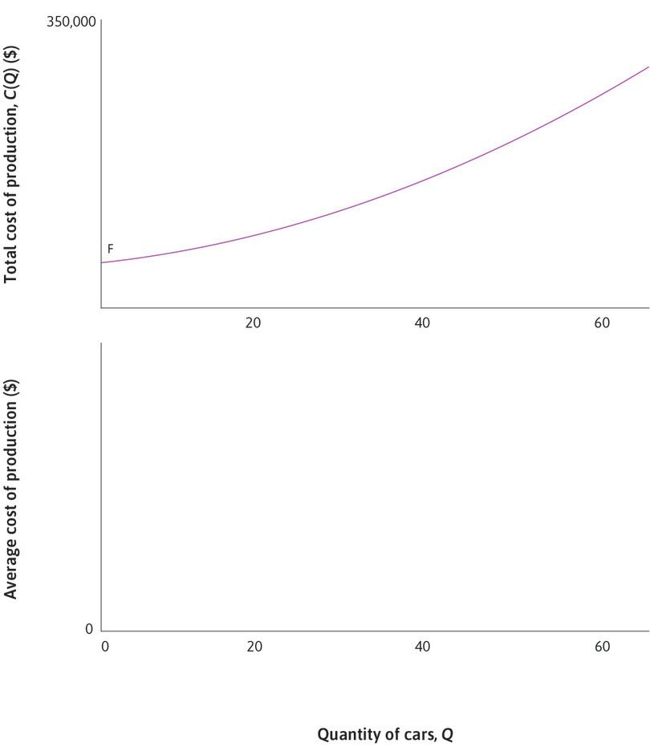
</center>
]

---

### Total cost of production and average cost of production

.pull-left[

- Total cost of production, $C(Q)$:

 - total cost of producing $Q$ amount of output

- Average cost of production = $C(Q)/Q$

- $F:$ fixed cost of production

 - Leads to increasing returns to scale
 
 - Average cost of production is decreasing when $Q$ is low (when $Q<40$ in our example graph)
]

.pull-right[

<center>
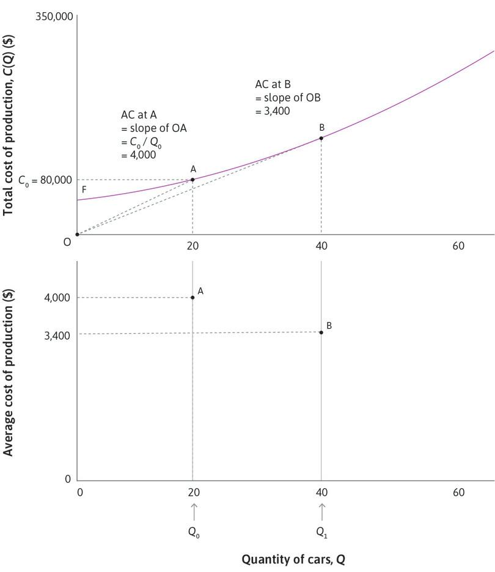
</center>
]


---
### Total cost of production and average cost of production

.pull-left[
- Total cost of production, $C(Q)$:

 - total cost of producing $Q$ amount of output

- Average cost of production = $C(Q)/Q$

- $F:$ fixed cost of production

 - Leads to increasing returns to scale
 
 - Average cost of production is decreasing when $Q$ is low (when $Q<40$ in our example graph)

- After certain amount of production, diseconomies of scale forces dominate, and average cost increases 
]

.pull-right[

<center>
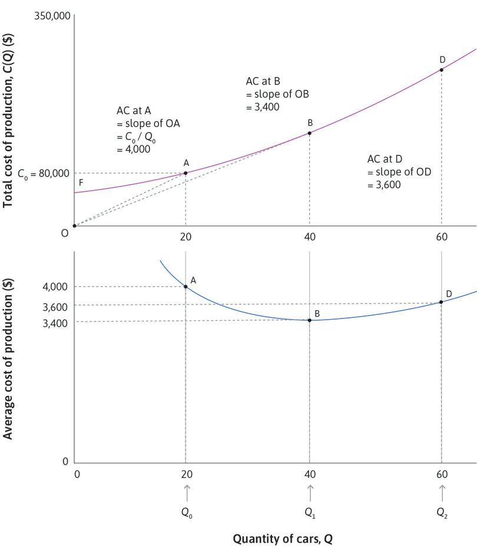
</center>
]

---
## Marginal cost of production

.pull-left[
- Derivative of the total cost function, $MC\equiv\frac{dC(Q)}{dQ}=C'(Q)$
 
- Slope of the total cost curve at a given point point

- The effect on total cost of producing one more unit of output

- In this example, $MC$ is increasing in $Q$

- $AC$ is decreasing if $AC<MC$

- $AC$ is incresing if $AC>MC$

- $AC$ is at its minimum if $AC=MC$
]

.pull-right[
<center>

</center>
]
---
## Isocost curves
.pull-left[
- Profit = Revenue - Cost 

$$
\pi = PQ-C(Q)=Q(P-AC)
$$
- An isocost curve represents all the price and quantity compbinations which lead to same level of profit

- MC curve intersect with each isocost curve at its lowest point

- Average cost curve represents the 0 profit isocost curve

]
.pull-right[
<center>
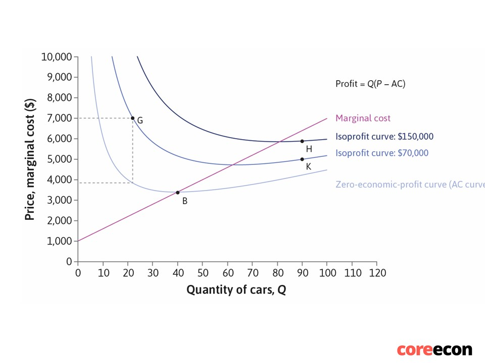
</center>
]


---
## Production

.pull-left[
- Production takes place at the 

- Demand curve = Firm’s feasible frontier 
  
  (slope = MRT)

- Isoprofit curves = Firm’s indifference curves

 (slope = MRS)

- Firm maximizes profits by choosing point where

   MRS = MRT 

]
.pull-right[
<center>
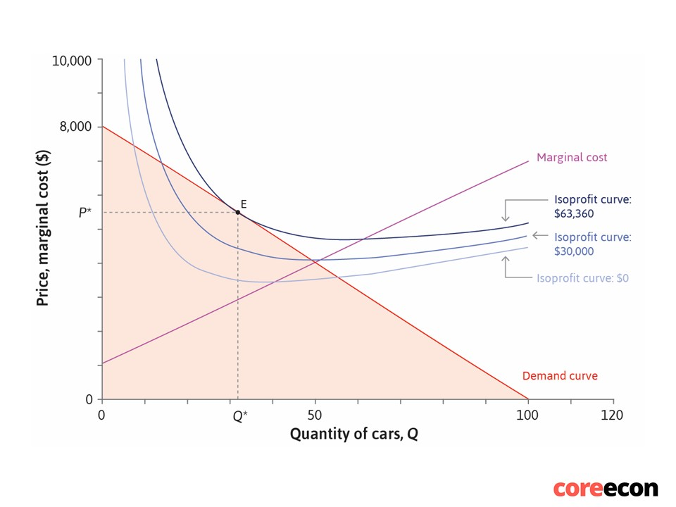
</center>
]


---
## Profit Maximization

.pull-left[

- Marginal revenue $(MR)$ = change in revenue from selling an aditional unit of output

$$ 
MR = \frac{dP(Q)Q}{dQ}
$$
- Profit is maximized when $MR = MC$ 
]
.pull-right[
<center>
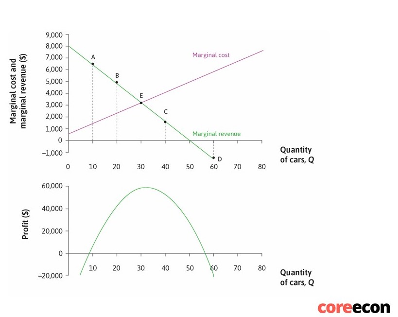
</center>
]

---
## Welfare analysis

.pull-left[
- Consumer surplus $(CS)$: total difference between willingness to pay and actual price

- Producer surplus $(PS)$: total difference between $MC$ and actual price

- Total surplus (total gains from trade) = $CS + PS$

- Deadweight loss: A loss of gains from trade relative to the pareto optimal allocation $MC=P$
]
.pull-right[
<center>
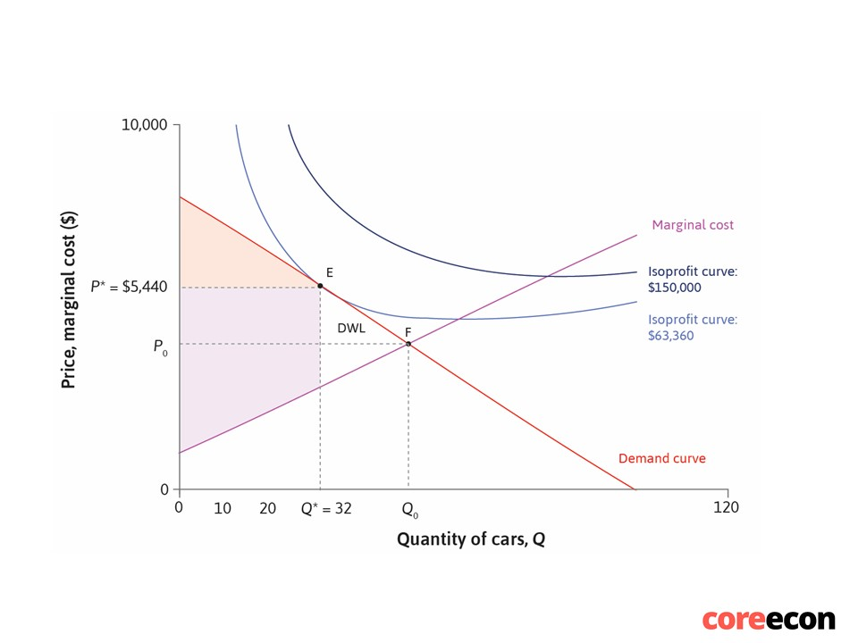
</center>
]

---
## Price elasticity of demand

.pull-left[


]
.pull-right[
<center>
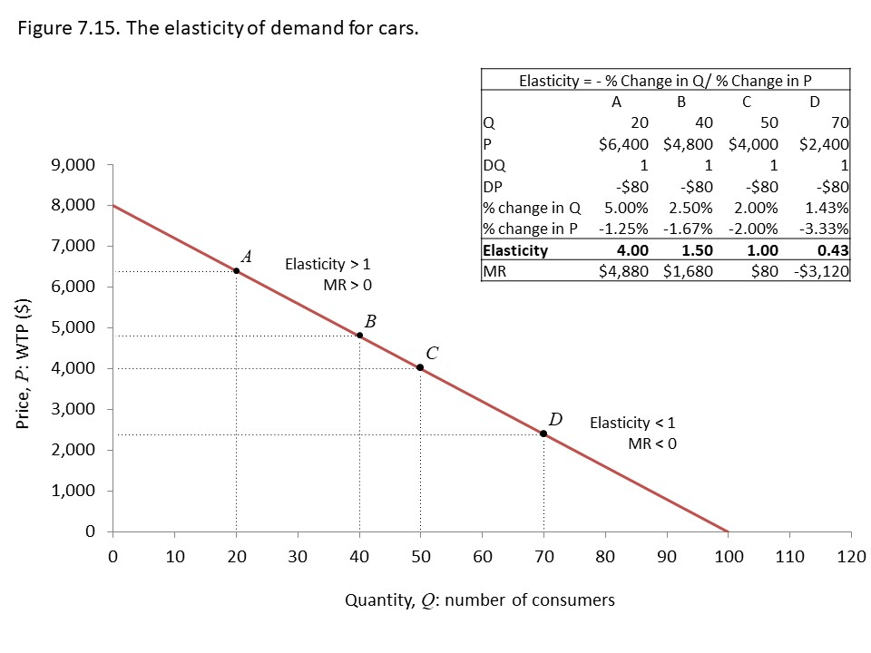
</center>
]
---
## Price elasticity and market power
.pull-left[
<center>
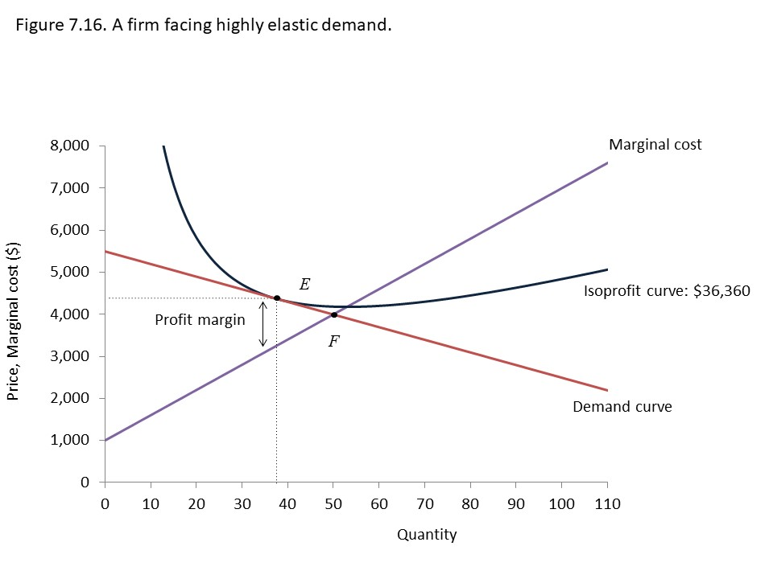
</center>
]
.pull-right[
<center>
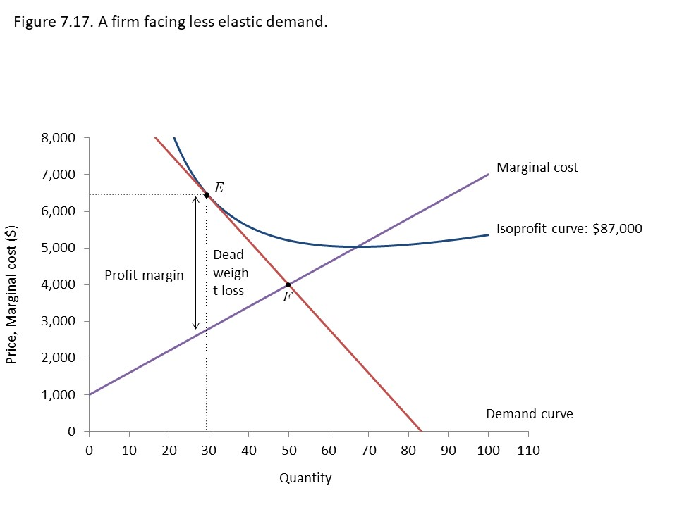
</center>
]


