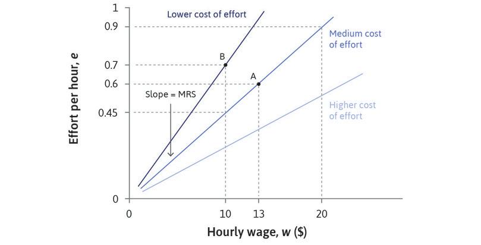

```{r setup, include=FALSE}
options(htmltools.dir.version = FALSE)
library(knitr)
opts_chunk$set(
  fig.align="center", ##fig.width=6, fig.height=4.5, 
  ## out.width="748px", ##out.length="520.75px",
  dpi=300, ##fig.path='Figs/',
  cache=T##, echo=F, warning=F, message=F
  )
```


## Firm decisions
.pull-left[

- What to produce

- How to produce

- Advertising budget

- R&D budget

- **How to set wages** 

- **How much to produce**

- **At what price to sell**

- ...
]

.pull-right[
<center>

</center>
Source: New Yorker

]
---
### Wage setting decision

<br>

<br>

"Labor discipline model" is a theory that characterizes the wage setting process. 

---

class: inverse, center, middle
name: labor_discipline

# Labor Discipline Model

<html><div style='float:left'></div><hr color='#EB811B' size=1px width=796px></html>


---
### Labor discipline model

- Workers have employment rents

 - loosing a job is costly
 
- Workers exert more effort if the cost of loosing a job is higher

 - The higher the wage, the costlier to lose a job
 
 - Exerting more effort is not desirable (disutility of work)
 
- Workers optimally decide on how much effort to put on

- Firms have a trade-off:

 - Higher wages induce more effort from workers, leading to more production, increasing profitability
 
 - Wage bill is a substantial portion of production costs, reducing profitability
 
- Firms optimally choose a wage rate to maximize profits 

---
### Labor discipline model, cont'd

<br>

- A sequential game between an employer and a employee:

1. The employer chooses a wage

2. Employee chooses a level of work effort after observing the wage

Notice that

- Given wage, the employee takes into account the cost of losing a job if she does not exert enough effort

- The employer anticates behavior of the employee and sets wage accordingly to maximize its profit


- A Nash equilibrium is a set of stragies (wage offer by the firm, effort level by the employee) where no one is willing to deviate from.


---
### Employment Rents


.pull-left[
[Read section 6.5 Determinants of the employment rent](https://core-econ.org/the-economy/book/text/06.html#65-determinants-of-the-employment-rent)


- Cost of loosing a job

 - The difference between value of job and the next best option

- Depends on  
 - wage, medical benefits, ... 
 - disutility of work (function of effort),
 - unemployment benefits (if exists)
 - duration of potential unemployment
 - stigma of unemployment,
 - other available employment opportunities  

- Reservation wage = value of next best option

- Employment rent = wage - reservation wage - distutility of effort
]

.pull-right[

<center>

</center>

Employment rent = $(12-6-2)\times 35 \times 44 = 6160$ 

]


---

### Worker's best response

.pull-left[
- For a given wage offered, the optimal effort exerted by the workers

- Say wage rate = $12
 - Why wouldn't a worker exert more effort than .5?
 - Why wouldn't a worker exert less effort than .5?
 
- Feasible set: 

 - Wage and effort pairs that a firm can get from its employees

- Slope of the best response curve = MRT
 - MRT stands for marginal rate of transformation of wages into effort
]
.pull-right[
<center>

</center>
]

---

### Shape of worker's best response

.pull-left[
- Effort at the reservation wage is 0

- Effort is increasing in wage

- Best response function is concave

 - Firms need to increase wage rate more to induce more effort from workers if the initial wage is higher
 
  - A result of increasing marginal disutility of effort

- For more detail read [Leibniz: The worker’s best response function](https://www.core-econ.org/the-economy/book/text/leibniz-06-06-01.html)

Questions:

- What happens to the best response curve if 

 - unemployment duration increases,
 
 - unemployment benefit decreases?
]


.pull-right[
<center>

</center>
]

---
## Firm's best response

- A firm's goal is to maximize profits

 - by maximizing production per employee
 
 - by minimizing cost of production (wage bill included)
 
- To maximize production, offer higher wages

 - $\Uparrow$ wages $\Rightarrow$ $\Uparrow$ effort $\Rightarrow$ $\Uparrow$ production

- To minimize cost, offer lower wages

- Trade-off between wages and effort
---
## Isocost lines

.pull-left[

#### How to deal with the wage effort trade-off?

- Minimize cost of effort (wage/effort)

- Cost of effort is the same at all points on an isocost line

- Cost of effort goes down as the isocosts shifts up

- Slope of isocost curve is MRS

 - MRS: marginal rate of substitution between effort and wage
 

]
.pull-right[

<br>

<center>

</center>
]

---
### Determination of wages

.pull-left[
- Profits are maximized at the steepest isocost line (the minimum feasible cost)
 
 - Equilibrium wage and effort is point A, where MRS = MRT
 
 - At point C, firms can increase profit by increasing wage offer (no equilibrium)

 - At any point on the left of A (where MRT=MRS), MRT > MRS
 
 - If MRT > MRS, a marginal increases in wage would lead to increase in effort more than the amount required to keep firm profits constant. Hence, firms will increase wages until point A.


- Efficiency wage: a wage rate greater than the reservation wage rate
 - What matters for profits is $e/w$, the efficiency per dollar of wage costs.
]
.pull-right[
<center>

</center>
]

---
### Involuntary unemployment

<br>

> "The state of being out of work, but preferring to have a job at the wages and working conditions that otherwise identical employed workers have."
> &ndash; Core the Economy

<br>

- In this model, there must be involuntary unemployment

- Suppose there is no involuntary unemployment

- Workers will not exert any effort

- Employers will not make any payment to workers who don't work


---

.pull-left[
### Position of workers' best response curve

The position of the best response curve depends on 

- the utility from consumption enabled by the wage income

- disutility of effort

- the probability of being caught while slacking

- the duration of potential unemployment

- the reservation wage

 - depends on the level of unemployment
 
- Higher unemployment rate
 - lower unemployment benefits
 
 - longer duration of unemployment

]


.pull-right[

<br>

<br>

<br>
<center>

</center>

As the duration of unemployment increases, the best response curve shifts to the left.
]

---
### Relevance of the previous section

<br>

<br>

- Previous section was a firm level analysis.

- We assumed unemployment rate is given in our analyis.

- In the coming weeks, we will analyze the determination of unemployment rate in the economy relying on what we have learned.


---
### Next week

<br>

<br>

Price setting firms
