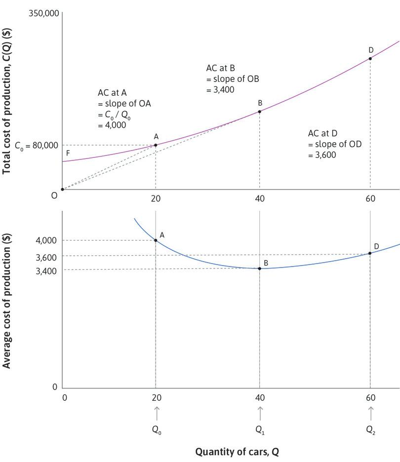

```{r setup, include=FALSE}
options(htmltools.dir.version = FALSE)
library(knitr)
opts_chunk$set(
  fig.align="center", ##fig.width=6, fig.height=4.5, 
  ## out.width="748px", ##out.length="520.75px",
  dpi=300, ##fig.path='Figs/',
  cache=T##, echo=F, warning=F, message=F
  )
```


### Relevance of the previous lecture

<br>

<br>

- Previous lecture was a firm level analysis.

- We assumed unemployment rate is given in our analyis.

- In the coming weeks, we will analyze the determination of unemployment rate in the economy relying on what we have learned.


---

class: inverse, center, middle
name: price_setting

# Price Setting Firms

<html><div style='float:left'></div><hr color='#EB811B' size=1px width=796px></html>


---
### Pricing and production decisions

- Relevant for firms selling differentiated products or firms with market power

> Market power: "An attribute of a firm that can sell its product at a range of feasible prices, so that it can benefit by acting as a price-setter (rather than a price-taker)." &ndash; Core the Economy


 
- Depends on

 - firm cost structure

 - market demand
 
- Analyze pricing and production decisions in 4 steps

 1. Represent cost structure as cost function
 
 2. Using the cost function, draw isoprofit curves
 
 3. Repersent market demand as a demand function
 
 4. Using the isoprofit curves and the market demand, find the profit maximizing price and output combination

---
## Cost Structure

### Understanding economies of scale

- Increasing returns to scale (Economies of scale):

 - $xF(K,AL) < F(xK,xAL)$

 - If inputs increase by a given proportion, output increases more than proportionally

- Constant returns to scale:

 - $xF(K,AL) = F(xK,xAL)$

 - If inputs increase by a given proportion, output increases proportionally
 
- Decreasing returns to scale (Diseconomies of scale):

 - $xF(K,AL) > F(xK,xAL)$

 - If inputs increase by a given proportion, output increases less than proportionally

---
### Economies of scale


.pull-left[
Potential causes:

- Fixed cost of production

- Learning by doing

- Greater bargaining power

- Network effects


### Diseconomies of scale

Potential causes:

- Additional layers of bureaucracy

- Increasing cost of monitor employees

- Necessity of establishing other departments

]

.pull-right[
<center>

</center>
Source: New Yorker

]


---
### Total cost of production and average cost of production

.pull-left[
- Total cost of production, $C(Q)$:

 - total cost of producing $Q$ amount of output

- Average cost of production = $C(Q)/Q$

- $F:$ fixed cost of production

 - Leads to increasing returns to scale
 
 - Average cost of production is decreasing when $Q$ is low (when $Q<40$ in our example graph)

- After certain amount of production, diseconomies of scale forces dominate, and average cost increases. 
]

.pull-right[

<center>

</center>
]

---
### Marginal cost of production

.pull-left[
- Derivative of the total cost function, $MC\equiv\frac{dC(Q)}{dQ}=C'(Q)$
 
- Slope of the total cost curve at a given point point

- The effect on total cost of producing one more unit of output

- In this example, $MC$ is increasing in $Q$

- $AC$ is decreasing if $AC<MC$

- $AC$ is incresing if $AC>MC$

- $AC$ is at its minimum if $AC=MC$
]

.pull-right[
<center>

</center>
]
---
### Isoprofit curves
.pull-left[
- Profit = Revenue - Cost 

$$
\pi = PQ-C(Q)=Q(P-AC)
$$
- An isoprofit curve represents all the price and quantity combinations which lead to same level of profit

- MC curve intersect with each isoprofit curve at its lowest point

- Average cost curve represents the 0 profit isoprofit curve

]
.pull-right[
<center>

</center>
]

---
### Market demand

.pull-left[
- Represents the number of items consumers are willing to purchase at a given price.

- Depends on 

 - income of consumers
 
 - price of other goods 
 
 - the utility consumers get from the consumption of the good

- Notice the upside down nature of the graph

 - The correct reading of this graph is that for a given price level, what the corresponding quantity demanded is.
]

.pull-right[
<center>

</center>

]
---
### Production

.pull-left[

- Demand curve = Firm’s feasible frontier 
 
 - Slope = MRT
 
 - MRT: Marginal rate of transformation of lower prices into greater quantity sold
  

- Isoprofit curves = Firm’s indifference curves

 - Slope = MRS
 
 - MRS: Marginal rate of substitution in profit creation between selling more and chargin more

- Firm maximizes profits by choosing point where

   MRS = MRT 

 - Production takes place at point E

]
.pull-right[
<center>

</center>
]
---
### Production, cont'd
.pull-left[

- Production has to take place on the demand curve

- Production takes place at point E (where MRT = MRS)

- On the left of point E

 - MRT > MRS 
 
 - If a firm cuts prices, quantity sold increases more than the amount required to keep profit constants.
 
 - Firm will produce more.
 
- On the right of point E

 - MRT < MRS 
 - If a firm increases prices, quantity sold decreases less than than the amount that keeps profit constant.
 - Firm will produce less.
]
.pull-right[
<center>

</center>
]

---
### Profit Maximization

.pull-left[

- Marginal revenue $(MR)$ = change in revenue from selling an aditional unit of output

$$ 
MR = \frac{dP(Q)Q}{dQ}
$$
- Profit is maximized when $MR = MC$ 

- If MR < MC

 - Firm will produce less to increase profits.
 
- If MR > MC

 - Firm will produce more to increase profits.
]
.pull-right[
<center>

</center>
]

---
### Welfare analysis

.pull-left[
- Consumer surplus $(CS)$: total difference between willingness to pay and actual price

- Producer surplus $(PS)$: total difference between $MC$ and actual price

- Total surplus (total gains from trade) = $CS + PS$

- Deadweight loss: A loss of gains from trade relative to the pareto optimal allocation $MC=P$
]
.pull-right[
<center>

</center>
]

---
### Price elasticity of demand

.pull-left[

$$\epsilon = - \frac{\% \text{Change in quantity demanded }}{ \% \text{Change in price}}$$ 

$$\epsilon = -\frac{\frac{\Delta Q}{Q}}{\frac{\Delta P}{P}}$$ 

- A measure of responsiveness of demand to price changes
- Notice that elasticity decreases as one moves down the line

$$ \epsilon = -\frac{\Delta Q}{\Delta P} \frac{P}{Q}$$ 
  - $\frac{\Delta Q}{\Delta P}$ is constant in a linear line, and $P/Q$ falls down the line. 
]
.pull-right[
<center>

</center>
]
---
## Price elasticity and market power

- Flat demand curve: less elastic demand (inelastic)
- Steep demand curce: more elastic demand


.pull-left[
<center>

</center>
]
.pull-right[
<center>

</center>
]

- Profit margin is higher with less elastic demand
 - Firms have more market power
 
---
### Next lecture

<br>

<br>


- Supply and demand in perfect competition


