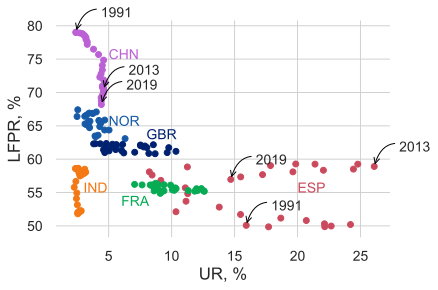

```{r setup, include=FALSE}
options(htmltools.dir.version = FALSE)
library(knitr)
opts_chunk$set(
  fig.align="center", ##fig.width=6, fig.height=4.5, 
  ## out.width="748px", ##out.length="520.75px",
  dpi=300, ##fig.path='Figs/',
  cache=T##, echo=F, warning=F, message=F
  )
```


### This lecture

<br>


- We will learn about

 - how the economy-wide labor market determines wages and employment

- We will model 

 - wage-setting behavior of the firms in the entire economy
 
 - price-setting behavior of the firms in the entire economy
 


---
### Measuring unemployment


<center>

</center>

---
### Definitions

- **Population of working age:** number of all the people aged between 15 and 64.

- **Labor force:** number of all the people in the working age who are working or seeking an employment outside of the household. 

- **Out of labor force:** number of working age people who are not working and not actively looking for a job

 - e.g. people unable to work due to sickness, stay at home parents to raise children, ...
 
- **Employed:** number of people that have a job

- **Unemployed:** number of people that does not have a job but actively seeking for one

---
### Labor force participation rate (LFPR)

$$ \text{Labor force participation rate} = \frac{\text{Labor force}}{\text{Population of working age}}$$


<center>

</center>

Data source: [The World Bank](https://data.worldbank.org/indicator/SL.TLF.CACT.ZS)


---
### Employment to working age population ratio (E/pop)

$$\text{Employment rate} = \frac{\text{Employed}}{\text{Population of working age}}$$


<center>

</center>


Data source: [The World Bank](https://data.worldbank.org/indicator/SL.EMP.TOTL.SP.ZS)


---
### Unemployment rate 

$$ \text{Unemployment rate} = \frac{\text{Unemployed}}{\text{Labor force}}$$


<center>

</center>

Data source: [The World Bank](https://data.worldbank.org/indicator/SL.UEM.TOTL.ZS)


---
### Labor force participation rate and unemployment rate

<center>

</center>


---
### Labor force participation rate and unemployment rate

<center>
<iframe src="./lecture5_files/figure-html/lfpr_ur.html" scrolling="no" style="width: 100%; height: 500px; border: 0px none;"></iframe>
</center>

---
### Recall what we learned in the previous lectures

<br>

<br>


At the firm level

- Wage setting: firms set wage sufficiently high to motiveate employees to exert high effort   

- Price setting: firms set a markup above the marginal cost of production to maximize profits  

---
### The chain of firm decisions

<br>

<center>

Nominal wage = f(other firms’ prices and wages, unemployment rate)
  
   $$ \Downarrow$$

Price = f(<span style="color:red">own nominal wage</span>, demand for own product)

$$ \Downarrow$$

Output = f(optimal <span style="color:red">price</span>, demand curve)

$$ \Downarrow$$

Number of employees = f(<span style="color:red">ouput</span>, production function)

</center>

- Notice that unemployment rate, input to the nominal wage fuction, depends on the number of employees fuction.

 - Hence macroeconomics: actions/decisions of all agents in the economy are interrelated.

---
### Goal of this lecture

Characterize

- real wage = $W/P$ in the entire economy

 - $W$ is the nominal wage, $P$ is the price level of a representative bundle of goods in the economy
 
 - What workers care about is the what they can purchase with their salaries

- level of employment in the entire economy

<br>

To achieve this goal

1. derive the wage-setting curve in the entire economy

2. derive the price-setting curve in the entire economy

3. put them together to get the equilibrium

---
.pull-left[
### Deriving the wage-setting curve 

- As unemployment decreases 

 - workers are more likely to find a job elsewhere had they lose their job
 
 - results in lower employment rents
 
 - to keep workers motivated, firms raise wages
 
 - hence there is a positive relationship between employment and real wages

- <span style="color:red">In the last seminar I overcomplicated this graph.</span>

 - <span style="color:red">Assume workers' best response curve have characteristics that a rightward shift always leads to an increase in the wage rate.</span>


]

.pull-right[

<br>


<center>

</center>

]


---

### Wage-setting curve
.pull-left[
- **Wage-setting curve** shows the real wage necessary to keep workers motivated at each level of economy-wide employment.

]

.pull-right[

<br>


<center>

</center>

]

---
### Wage-setting curve
.pull-left[

- **Wage-setting curve** shows the real wage necessary to keep workers motivated at each level of economy-wide employment.

- At a given real wage, the distance between the corresponding employment rate and the labor force is the unemployment rate (times the labor force participation rate)

 - Example, at real wage = $w_L$. the unemployment rate is equal to 12%.


]

.pull-right[

<br>


<center>

</center>

]

---
### Wage-setting curve
.pull-left[

- **Wage-setting curve** shows the real wage necessary to keep workers motivated at each level of economy-wide employment.

- At a given real wage, the distance between the corresponding employment rate and the labor force is the unemployment rate (times the labor force participation rate)

 - Example, at real wage = $w_L$. the unemployment rate is equal to 12%.

- As wages increase, the unemployment rate decreases.

]

.pull-right[

<br>


<center>

</center>

]


---


### An estimated wage-setting curve

.pull-left[
<br>


An example wage-setting curve 

- estimated from the Current Population Survey (USA) from 1979 to 2015 by Stephen Machin

- using unemployment rates and wages in the local areas 
]

.pull-right[

<br>


<center>

</center>

]

---

### Deriving the price-setting

- Given a firm's own wage and the demand for own product, the marketing department sets the prices

- Given the price chosen by the marketing department, production department sets the quantity

- Given production, HR hires workers

### Assumptions 

- Labor is the only factor of production

- One unit of labor produces $\lambda$ units of output

 - Constant marginal cost of production
 
 - Marginal cost of production is equal to wage rate over labor productivity, $W/\lambda$
 
- All firms face the same demand curve


---
### Price Setting curve

.pull-left[

- Notice that Wage curve is the marginal cost curve

- Markup, $\mu\equiv\frac{p^\ast-MC}{p^\ast} = \frac{p^\ast-W/\lambda}{p^\ast}$, where $p^\ast$ is the firm price

 - Markup is a measure of market power
 
 - Remember that in a competitive market, $p^\ast=MC$, and hence firms don't have any market power
 
- Since all firms face the same demand curve, they all charge the same price, hence $p^\ast=P$, where $P$ is the price of a bundle of the goods in the economy.

$$ \mu  = \frac{P-W/\lambda}{P} $$
 
]


.pull-right[

<br>


<center>

</center>

]

---


### Price setting

- We assume that the markup, $\mu$ is determined by the market conditions such

 - level of competetition in the market
 
 - elasticity of demand
 
- Then $\mu  = \frac{P-W/\lambda}{P} = 1 - \frac{W}{P} \frac{1}{\lambda} \Rightarrow \frac{W}{P}=\lambda - \lambda \mu$

- Real wage, $\frac{W}{P} = \lambda - \lambda \mu$, is independent of the employment level

- To better understand this point, read 

 - [Einstein: The elasticity of demand and the marginal revenue](https://core-econ.org/the-economy/book/text/07.html#einstein-the-elasticity-of-demand-and-the-marginal-revenue)
 
 - [Einstein: The price-setting curve](https://core-econ.org/the-economy/book/text/09.html#einstein-the-price-setting-curve)

 - Or, check out my [slides](./lecture5.html#price-math)
---
name: back-normal

### Price-setting curve

- It's actually a point (or flat line independent of employment level)

- Given a wage rate, all firms charge a price $P$ such that $W/P$ is equal to a constant that is determined by factors such as
 - consumer preferences 
 - level of competition
 - labor productivity

<center>

</center>


---


### Price-setting curve, cont'd

- At point A, real wage is high, and output is high
 - Given demand, firms raise prices, output decreases, but profits increase.
 - Economy moves towards point B
 
- At point C, real wage is low, and output is low
 - Given demand, firms decreases prices, output increases, but profits increase.
 - Economy moves towards B 

<center>

</center>

---

### Labor market equilibrium

.pull-left[
- Intersection of the wage-setting curve and price-setting curve gives the equilibrium.
 
 - Point $X$ in the graph
 
- In equilibrium, there is unemployment

- In equilibrium, real wage is lower than labor productivity
]

.pull-right[

<br>
<center>

</center>
]

---

### Next lecture

<br>

<br>


- Distribution of output

- Involuntary unemployment

- Demand-deficit unemployment

- Labor market policies

- Labor unions


---
### Reduction in aggregate demand

.pull-left[
- **Aggregate demand**: sum of demand by all agents in the economy, such as 
 - consumers,
 - firms,
 - goverments,
 - agents from other countries
 
- Suppose there is a reduction in the aggragete demand 


]

.pull-right[

<br>
<center>

</center>
]


---
### Reduction in aggregate demand

.pull-left[
- **Aggregate demand**: sum of demand by all agents in the economy, such as 
 - consumers,
 - firms,
 - goverments,
 - agents from other countries
 
- Suppose there is a reduction in the aggragete demand 

- Equilibrium point will be $B$.


]

.pull-right[

<br>
<center>

</center>
]


---
### Reduction in aggregate demand

.pull-left[
- **Aggregate demand**: sum of demand by all agents in the economy, such as 
 - consumers,
 - firms,
 - goverments,
 - agents from other countries
 
- Suppose there is a reduction in the aggragete demand 

- Equilibrium point will be $B$.

 - Unemployment increases

- **Cyclical unemployment:** the rise in unemployment as a result in reduction in aggregate demand

 - Also known as demand-deficient unemployment
]

.pull-right[

<br>
<center>

</center>
]


---
### Adjustment process of the economy


.pull-left[
- After the reduction in demand, the economy as at point $B$.
 - Notice that, there is no change in the real wage
 - There is no change in the nominal wage yet
 - There is no change in the prices yet
 - Given the wage rate, $p^\ast$ is the optimal price for the firm
 
- Then HR department lowers wages thinking that with higher unemployment, lower wages will still motivate workers to exert enough effort

- Isoprot curves become steeper
 - The slope of the isoprofit curve is $\frac{P-W/\lambda}{Q}$
 - As $W$ decreases, curve becomes steeper


]

.pull-right[

<br>

<center>

</center>
]


---
### Adjustment process of the economy, cont'd

.pull-left[
- With the reduced wage, $B$ is no longer the profit maximizing point

- The firm chooses point $X$ to maximize profit
 - Price goes down to $p^\ast$
 - Lower prices leads to higher quantity demanded, $p^{\ast \ast}$
 
- At the new equilibrium
 - real wage is still unchanged
 - unemployment is unchanged
 - wage and prices are lower

]

.pull-right[

<br>

<center>

</center>
]


---
### Adjustment process of the economy, cont'd (2)

.pull-left[
- The adjustment process described in the previous slided may not work as smoothly.
 
 - Resiliance from the workers
 
 - If consumers anticipate price decline, they may postpone their purchases, which reduces demand.


]

.pull-right[

<br>
<center>

</center>
]


---
### Government intervention


.pull-left[

Governmensts can react to reduction in demand by

- fiscal policy
  - increasing spending or reducing taxes
  
- monetary policy
 - reducing interest rates to promote investment and durable goods consumption

- These policies will shift up the demand

- More on these topics in later lectures

]

.pull-right[

<br>
<center>

</center>
]

---
### Distribution of income

<center>

</center>

- This model has implications on the distribution of income in the economy.

- There are there groups:
 
 - unemployed: 10% and earn nothing
 - employed: 80% and earn 60% of total income
 - firm owners: 10% and earn 40% of total income

- Share of income going to emloyees is determined by the real wage over productivity ratio: $\frac{\frac{W}{P}}{\lambda}$

---
### Measuring inequality

<center>

</center>

- We can draw lorenz curve and calculate the gini coefficient.

- Read [Unit 5.12 Measuring income inequality](https://core-econ.org/the-economy/book/text/05.html#512-measuring-economic-inequality)


---
### The effect on real wage increase on inquality

<center>

</center>

- Suppose real wages increase and the equilibrium moves to point B

 - Less unemployed
 
 - Workers earn more
 
 - Owners earn less
 

---
### The effect on real wage increase on inquality

<center>

</center>

- Suppose real wages increase and the equilibrium moves to point B

 - Less unemployed
 
 - Workers earn more
 
 - Owners earn less

- Inequality decreases
---
### Unions


.pull-left[

Labour union = an organization consisting predominantly of employees. Its main activities include the negotiation of rates of pay and conditions of employment for its members. 


]

.pull-right[

<br>
<center>

</center>
]
---
### Unions


.pull-left[

Where workers are organized into trade unions, the wage is not set by the employer but instead is negotiated between union and firm. 

The bargained wage can be above the wage-setting curve
    the wage-setting curve is about the employer’s threat of firing a worker
    the union can threaten to “dismiss” the employer by going on strike


]

.pull-right[

<br>
<center>

</center>
]

---
### Unions


.pull-left[
In equilibrium, wage is unchanged, but employment and firm’s profits are lower.

The model tells us that labour unions will increase unemployment rates.

However, this is not clear in the data.


]

.pull-right[

<br>
<center>

</center>
]

---
### Labor market policies

Shifts in the price-setting curve:
Education & training: labour productivity ↑
Wage subsidy: Production costs and prices ↓

Shifts in the wage-setting curve:
Lower unemployment benefit: reservation wage ↓

Shifts in labour supply curve: 
immigration policies: labour supply ↑
childcare provision: female labour participation ↑


---


name: price-math
### Price-setting curve, [mathematical](./lecture5.html#back-normal)


.pull-left[
- Recall that at the optimum, slope of the isoprofit curve (MRS) is equal to the slope of the demand curve (MRT)


- Write down the slope of the demand curve as a function of elasticity

$$ \epsilon = -\frac{\frac{\Delta Q}{Q}}{\frac{\Delta P}{P}} = -\frac{\Delta Q}{\Delta P}\frac{P}{Q}$$
$$MRT \equiv -\frac{\Delta P}{\Delta Q} = \frac{P}{Q} \frac{1}{\epsilon}$$
- Then write down MRS, say, at the $\pi=k$ isoprofit line 

$$P*Q - Q*AC = k$$ 

- Differentiate alongside this curve

$$dP*Q+P*dQ-dQ*AC = 0$$

]
.pull-right[

$$dP*Q -dQ(P-AC) = 0$$

$$MRS=\frac{dP}{dQ}=\frac{P-AC}{Q}=\frac{P-W/\lambda}{Q}$$
since average cost of production is equal to marginal cost (in this economy with cost unit costs), which is equal to $W/\lambda$

- In optimum, $MRS=MRT$

$$\frac{P-W/\lambda}{Q}=\frac{P}{Q} \frac{1}{\epsilon}$$
Then

$$\mu = \frac{P-W/\lambda}{P}= \frac{1}{\epsilon} \Rightarrow \frac{W}{P} = \lambda - \frac{\lambda}{\epsilon}$$
- Real wage is positively related to elasticity of substituion, but independent of employment
]


