```{r setup, include=FALSE}
options(htmltools.dir.version = FALSE)
library(knitr)
opts_chunk$set(
  fig.align="center", ##fig.width=6, fig.height=4.5, 
  ## out.width="748px", ##out.length="520.75px",
  dpi=300, ##fig.path='Figs/',
  cache=T##, echo=F, warning=F, message=F
  )
```


### Last Lecture

- We have learned the definitions of 
 
 - labor force participation rate
 
 - unemployment rate
 
 - employment rate
 
- We derived the wage-setting curve

- We derived the price-setting curve

- We characterized the labor market equilibrium using the above two

---

### This lecture

<br>

We will put our model to use

Using our model, we will

- characterize distribution of output

- learn effects of a reduction in aggreage demand on the economy
 
 - demand-deficit unemployment
 
 - automatic adjustment process of the economy
 
 - goverment policies to counter the reduction in demand

- learn the effects of labor unions on the economy

- learn the effects of various labor market policies on the economy


---
### Reduction in aggregate demand

.pull-left[
- **Aggregate demand**: sum of demand by all agents in the economy, such as 
 - consumers,
 - firms,
 - governments,
 - agents from other countries
 
- Suppose there is a reduction in the aggragete demand 

- Equilibrium point will be $B$.

 - Unemployment increases

- **Cyclical unemployment:** the rise in unemployment as a result of reduction in aggregate demand

 - Also known as **demand-deficient unemployment**
]

.pull-right[

<br>
<center>
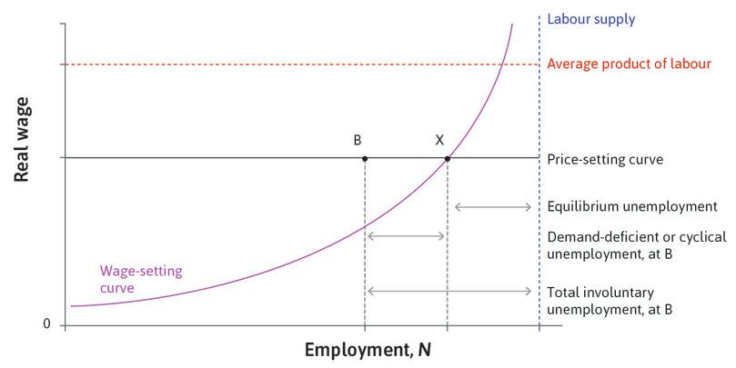
</center>
]


---
### Adjustment process of the economy


.pull-left[
- After the reduction in demand, the economy is at the point $B$.
 - Notice that, there is no change in the real wage
 - There is no change in the nominal wage yet
 - There is no change in the prices yet
 - Given the wage rate, $p^\ast$ is the optimal price for the firm
 
- Then HR department lowers wages thinking that with higher unemployment, lower wages will still motivate workers to exert enough effort

- Isoprot curves become steeper
 - The slope of the isoprofit curve is $\frac{P-W/\lambda}{Q}$
 - As $W$ decreases, isoprofit curve becomes steeper


]

.pull-right[

<br>

<center>
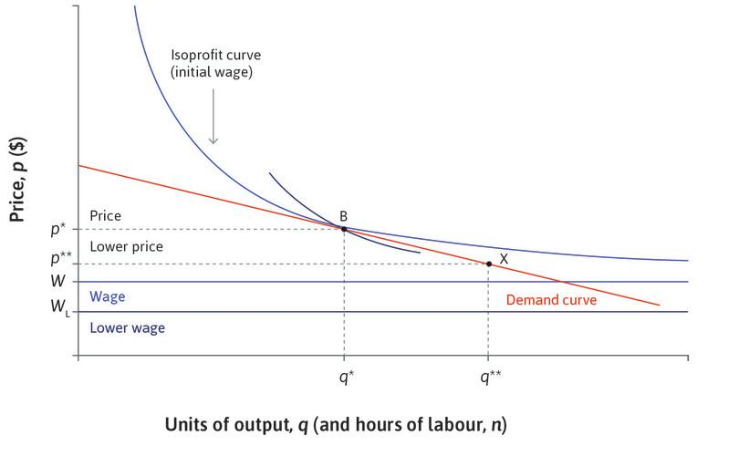
</center>
]


---
### Adjustment process of the economy, cont'd

.pull-left[
- With the reduced wage, $B$ is no longer the profit maximizing point

- The firm chooses point $X$ to maximize profit
 - Price goes down to $p^{\ast \ast}$
 - Lower prices leads to higher quantity demanded, $q^{\ast \ast}$
 
- At the new equilibrium
 - real wage is still unchanged
 - unemployment is unchanged
 - wage and prices are lower

]

.pull-right[

<br>

<center>
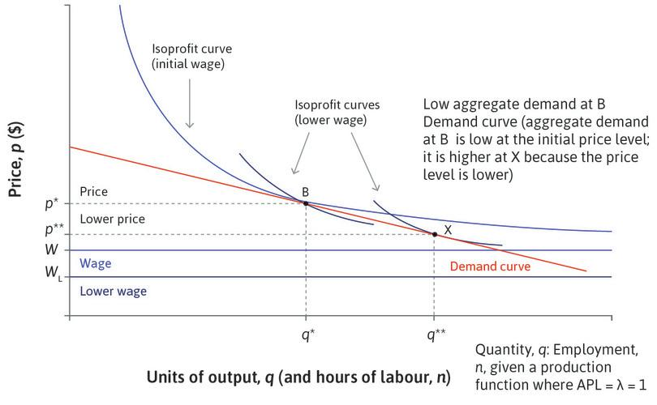
</center>
]


---
### Adjustment process of the economy, cont'd (2)

.pull-left[
- The adjustment process described in the previous slided may not work as smoothly.
 
 - Resistance from the workers
 
 - If consumers anticipate price decline, they may postpone their purchases, which reduces demand.


]

.pull-right[

<br>
<center>
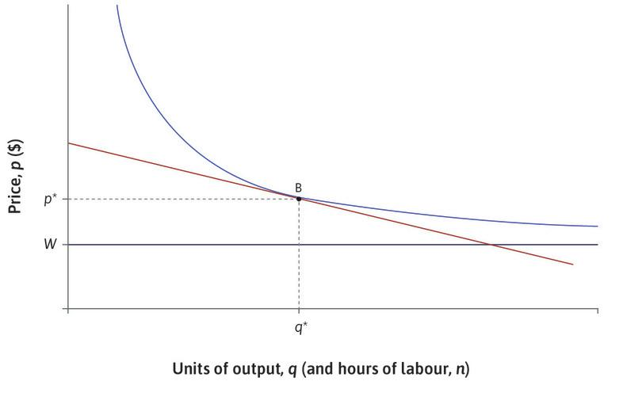
</center>
]


---
### Government intervention


.pull-left[

Governmensts can react to reduction in demand by

- fiscal policy
  - increasing spending or reducing taxes
  
- monetary policy
 - reducing interest rates to promote investment and durable goods consumption

- These policies will shift up the demand

- More on these topics in later lectures

]

.pull-right[

<br>
<center>
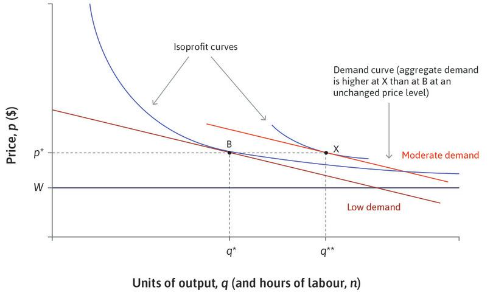
</center>
]

---
### Distribution of income

<center>
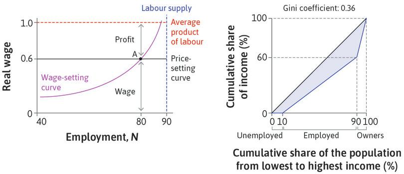
</center>

- This model has implications on the distribution of income in the economy.

- There are there groups:
 
 - unemployed: 10% and earn nothing
 - employed: 80% and earn 60% of total income
 - firm owners: 10% and earn 40% of total income

- Share of income going to emloyees is determined by the real wage over productivity ratio: $\frac{\frac{W}{P}}{\lambda}$

---
### Measuring inequality

<center>
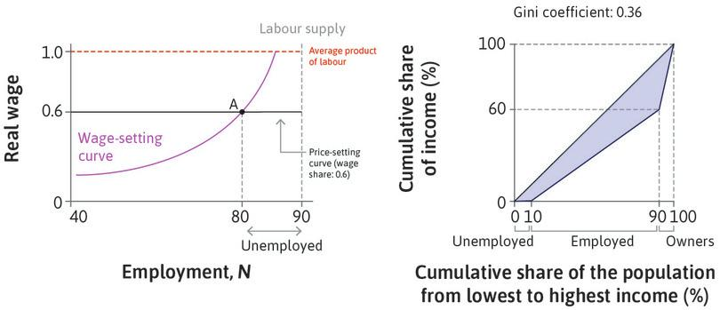
</center>

- We can draw lorenz curve and calculate the gini coefficient.

- Read [Unit 5.12 Measuring income inequality](https://core-econ.org/the-economy/book/text/05.html#512-measuring-economic-inequality)


 

---
### The effect on real wage increase on inquality

<center>
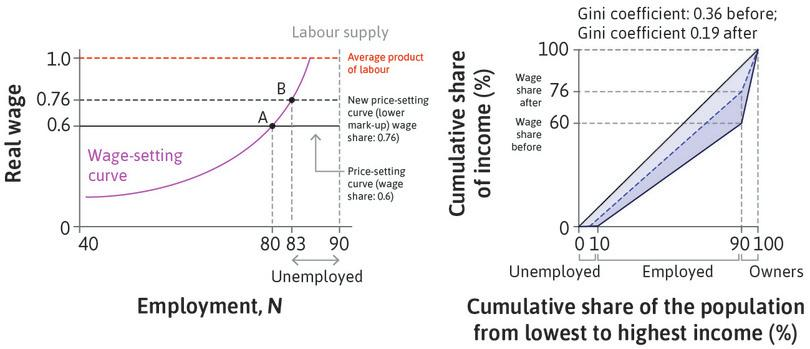
</center>

- Suppose real wages increase and the equilibrium moves to point B

 - Less unemployed
 
 - Workers earn more
 
 - Owners earn less

- Inequality decreases
---
### Labor Unions


.pull-left[
 
**Labour union:** 

 - an organization formed by employees
 
 - negotiates pay and work conditions with employers
 
]

.pull-right[

<br>
<center>
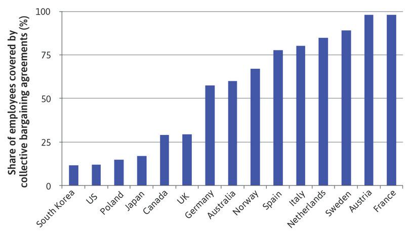
</center>

Source: Jelle Visser, 2015 [ICTWSS Data base, Version 5.0](http://uva-aias.net/en/ictwss)

Data from late 2010s.
]
---
### The effect of wage bargaining on the economy


.pull-left[

- With strong unions, the wage is a result of negotiations between the firm and the union. 

- The bargained wage-setting curve can be above the wage-setting curve

- No impact on real-wages

- Employment is lower

]

.pull-right[

<br>
<center>
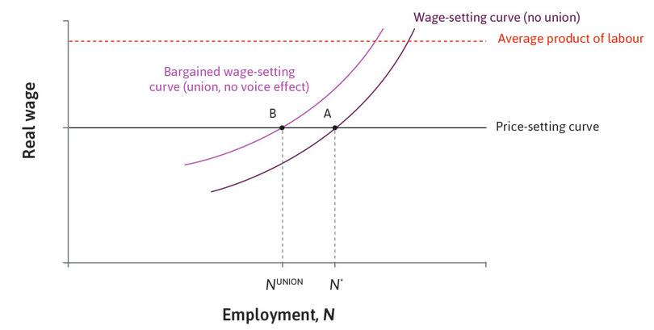
</center>
]

---
### The effect of wage bargaining on the economy, cont'd

.pull-left[
- In equilibrium
 
 - wage is unchanged
 
 - employment and firm’s profits are lower.

- Data does not support the implications of the model


]

.pull-right[

<br>
<center>
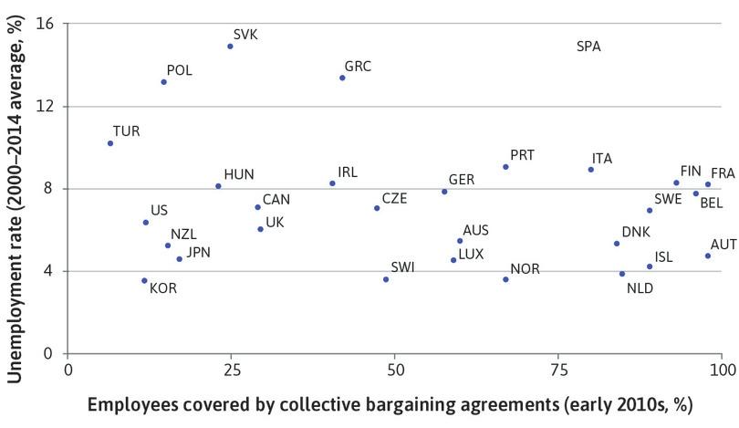
</center>
]

---
### Labor market policies

- Shifts in the price-setting curve:

 - Education & training: labor productivity $\uparrow$

 - Wage subsidy: Production costs and prices $\downarrow$

- Shifts in the wage-setting curve:

 - Lower unemployment benefit: reservation wage $\downarrow$

- Shifts in labour supply curve: 

 - immigration policies: labour supply $\uparrow$

 - childcare provision: female labour participation $\uparrow$


---
### Next week

- The credit market

 - Read [Unit 10 - Banks, Money, and the Credit Market](https://core-econ.org/the-economy/book/text/10.html)