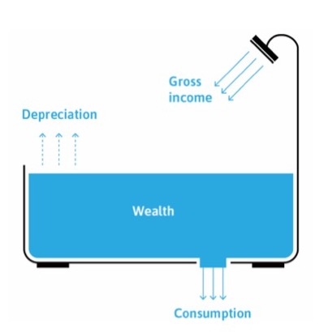
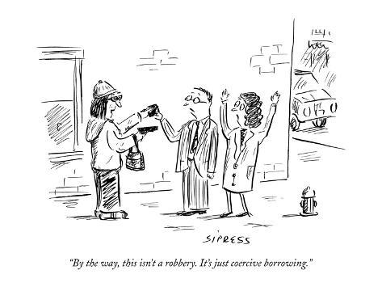
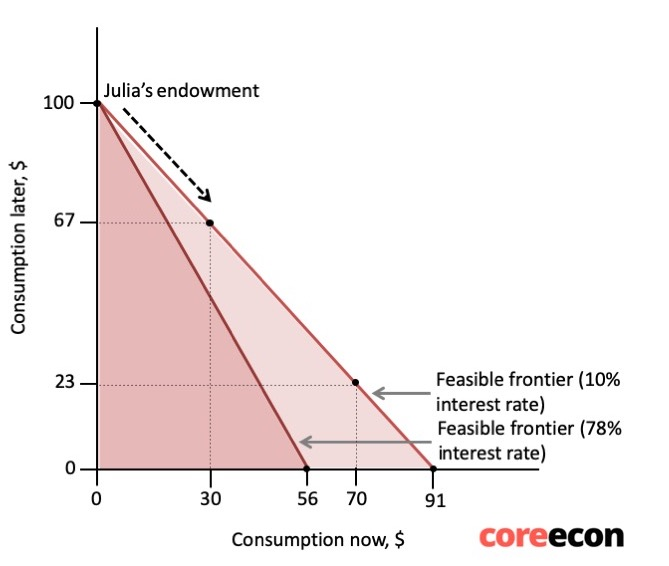
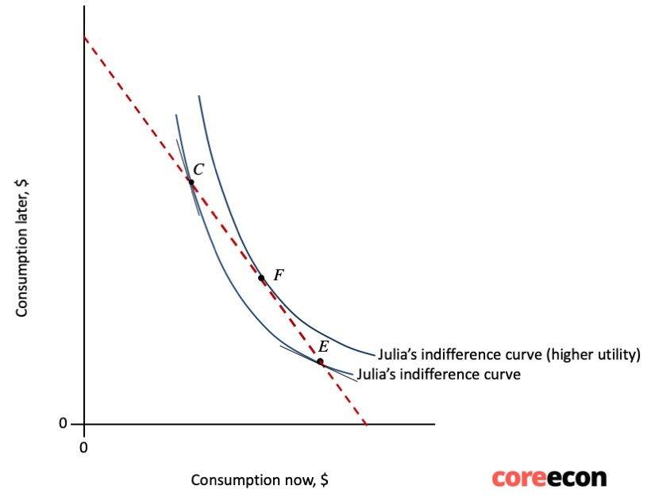
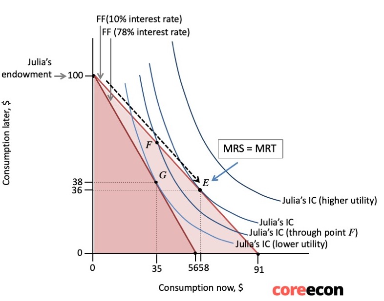
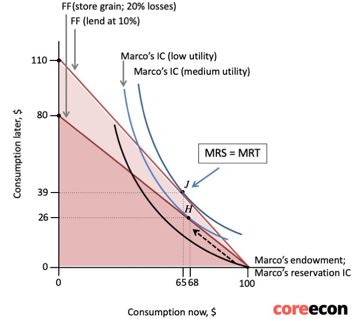
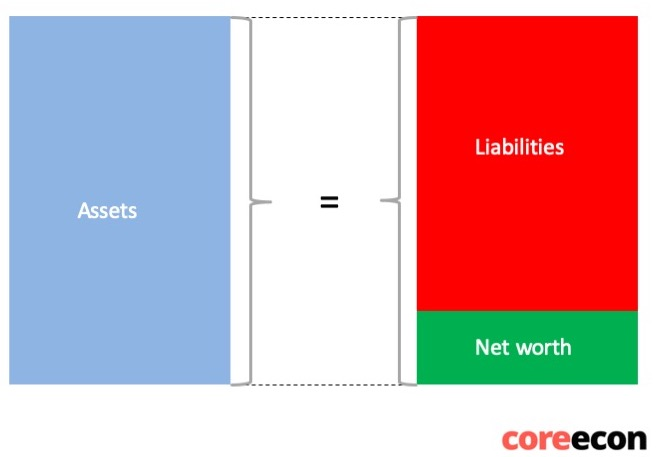
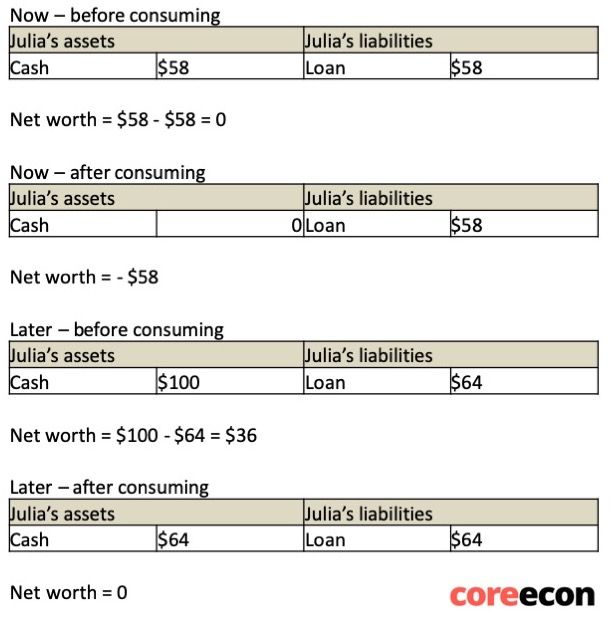
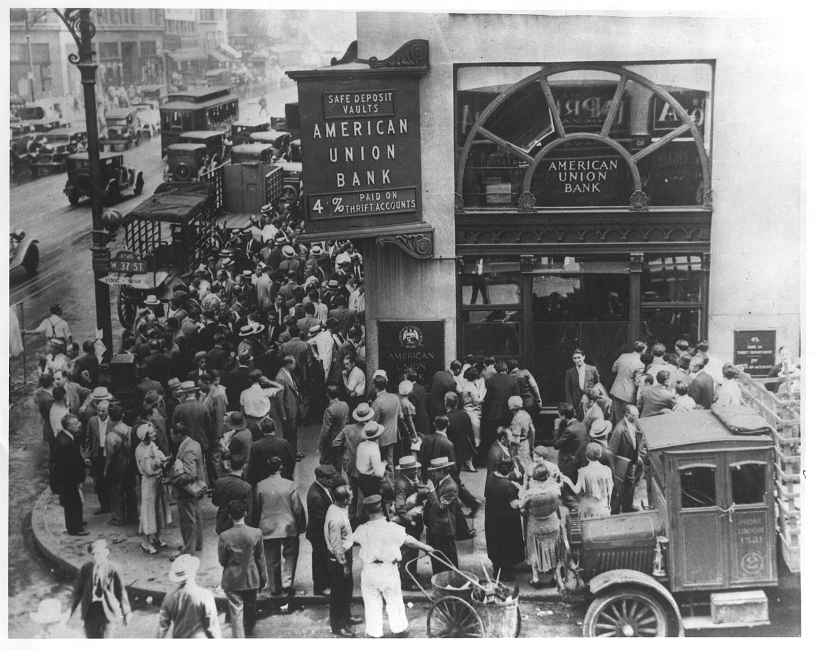

```{r setup, include=FALSE}
options(htmltools.dir.version = FALSE)
library(knitr)
opts_chunk$set(
  fig.align="center", ##fig.width=6, fig.height=4.5, 
  ## out.width="748px", ##out.length="520.75px",
  dpi=300, ##fig.path='Figs/',
  cache=T##, echo=F, warning=F, message=F
  )
```


### This lecture

<br>

<br>


- Understand borrowing, saving and investment decisions of individuals

- Understand the role of commercial banks and the central bank in the economy

- Explain how banks make money and the risks they face and pose

---


class: inverse, center, middle
name: income

# Income, borrowing and saving

<html><div style='float:left'></div><hr color='#EB811B' size=1px width=796px></html>


---
### Money

<br>


- **Money** = A medium of exchange used to purchase goods or services

 - consists of bank notes, bank deposits, cheques, …

- Money allows purchasing power to be transferred among people.

- Trust is a crucial element of money

 - Everyone should trust that money will be accepted by others in transactions
 
 - One accepts money as payment believing that they can use money to purchase other goods/services


---
### Income and wealth

.pull-left[


- **Wealth =**  Stock of things owned 
 
 - or, value of that stock

 - includes buildings, land, machinery, capital goods, equities, diamonds, ... 
 
 - debts a person owes substracted from their wealth
 
 - debts owed to a person added  to their wealth

- **Income =** The amount of money one receives over some period of time (flow).

 - from market earnings, investments, government

- Change in weath = Gross income - consumption - depreciation
]

.pull-right[
<center>

</center>
]
---
### Other definitions

<br>
- **Gross income = ** after tax income

- **Depreciation =** Reduction in the value of a stock of wealth over time.

 - For example, machines/buildings wear off by time/usage

- **Net income =** The maximum amount that one could consume without running down wealth. 

 Net income = gross income – depreciation

- **Earnings =** Wages, salaries, and other income from labour.

- **Savings =** Income that is not consumed.

- **Investment =** Expenditure on newly produced capital goods.

 - Investment in economics jargon $\neq$ investment in common language
---

### Consumption over time

<br>

<br>


- There is a trade-off between consuming goods now and later.

 - The amount you consume today affects your savings
 
 - Your savings affect your consumption later

- The opportunity cost of having more goods now is having fewer goods later.

- One can borrow to consume more today, as well as lend today to consume later

 - Seems trivial, but borrowing/lending is a crucial aspect of modern economies


---
### Borrowing


.pull-left[


- Borrowing allows us to buy more now, at the cost of buying less later. 

- Interest rate $(r)=$ The price of bringing some buying power forward in time.

- If one borrows $1 today, they will pay $(1+r) tomorrow.

 - Borrower gives up $(1+r) amount of consumption tomorrow to have $1 more consumption today

 - $(1+r)=$ Tradeoff between current and future consumption (MRT)
 
 - MRT: marginal rate of transformation of goods from the future to the present

]


.pull-right[
<center>

</center>

Source: New Yorker
]

---
### Borrowing, cont'd


.pull-left[

- In this example, Julia does not have any wealth today, but she will have $100 later.

- Suppose the interest rate is 10%, $r=.1$

- She can consume nothing today, and $100 later

- She can borrow in exchange of her future earnings

- She can consume as much as $91 (=100/(1.1)) today.

- She can consume at any point on the line connecting (0,100) and (91,0)

$$  (1+r)c_n + c_l = 100 $$
- If interest rate goes up to 78%, she can consume as much as $56 (=100/(1.78)) today.

]

.pull-right[
<center>

</center>
]


---
### Preferences for consumption


.pull-left[


<br>

- Borrowing allows us to bring consumption forward

- How much consumption an individual will bring forward depends on the individual's preferences.

- Preferences are affected by 
 
 - consumption smoothing motive

 - pure impatience 

]

.pull-right[

<center>

</center>


]

---
### Consumption smoothing

.pull-left[

<br>


- **Diminishing marginal returns to consumption:**

 - The value of an additional unit of consumption declines, the more consumption the individual has. 

- An individual smoothes their consumption to avoid 

 - consuming a lot in one period 
 
 - and little in the other.


]

.pull-right[

<center>

</center>

Source: New Yorker
]
---
### Pure impatience

<br>


- Pure impatience = being impatient as a person.

- An individual is impatient if they value

 - a good more highly now than later 
 
 - when her initial endowment is having the same in both periods

- Reasons for impatiences:

 - Myopia (short-sightedness): People experience the present satisfaction more strongly than the same satisfaction later
 
 - Prudence: People know that they may not be around in the future, and so they want to consume now


---
### Optimal decision-making

.pull-left[

- Discount rate $(\rho)$ = a measure of a person's impatience.

- Discount rate $(\rho)$ is determined by 
  
  - Consumption smoothing motive
  
  - Pure impatience 

- Individuals borrow at the point where discount rate = interest rate

 $$ MRS = MRT $$
 $$ 1+\rho = 1+r $$

- In this example, Julia is a borrower.

 - She consumes more than what she has right now by borrowing

]

.pull-right[
<center>

</center>
]


---
### Saving and lending

.pull-left[

<br>


- In this example, Marco is a saver

 - He consumes less than what he has today

- A saver smoothes his consumption by postponing it into the future.

- Lending money at interest expands the saver’s feasible set, compared to simply storing it.


]

.pull-right[
<center>

</center>
]

---


class: inverse, center, middle
name: credit

# Principal-agent problem

<html><div style='float:left'></div><hr color='#EB811B' size=1px width=796px></html>


---
### Principal-agent problem


- Principal-agent problem 

 - a conflict of interest between a principal and an agent, 

--
 
 - about some hidden action or attribute of the agent (asymmetric information)

--

 - that cannot be enforced or guaranteed in a binding contract.

--

- Lenders and borrowers have different information about the project's success

 - asymmetric information about the riskiness of a project

- Lenders cannot perfectly observe borrower’s effort so cannot ensure that the project succeeds. 

--

- To resolve the conflict of interest between the principal (lender) and the agent (borrower):

--

 - **Equity:** the lender may require the borrower to put some of her wealth into the project

--

 - **Collateral:** the borrower has to set aside property that will be transferred to the lender if the loan is not repaid

---
### Credit rationing

<br>

<br>


- Those with less wealth find it more difficult to provide equity or collateral. 

- Credit rationing = when those with less wealth
  
 - borrow on unfavourable terms compared with those with more wealth (credit-constrained)

 - or are refused loans entirely (credit-excluded)


---


class: inverse, center, middle
name: balance

# Balance Sheet

<html><div style='float:left'></div><hr color='#EB811B' size=1px width=796px></html>

---
### Balance sheet

.pull-left[

- Summarizes what 

 - the household or firm owns
 
 - what it owes to others.

- Assets = Anything of value that is owned. 

- Liabilities = Anything of value that is owed. 

- Net worth = assets - liabilities


]

.pull-right[
<center>

</center>
]

---
### Balance sheet and wealth

.pull-left[

- Wealth or net worth does not change when you lend or borrow.

- A loan adds both assets and liabilities to the balance sheet:
 
 - the borrowed money (cash) is an asset

 - the debt is an equal liability

- Wealth goes down after you consume the borrowed amount
]

.pull-right[
<center>

</center>
]

---


class: inverse, center, middle
name: banks

# Banks and money

<html><div style='float:left'></div><hr color='#EB811B' size=1px width=796px></html>


---
### Banks

<br>

<br>


- A bank is a firm that makes profits by lending and borrowing.

- Banks borrow from households (deposits), other banks, and the central bank. 

- The interest they pay on deposits is lower than the interest they charge on loans, which is how banks make profits.

---
### Types of money

- Base money:

 - cash held by households, firms, and banks
 
 - reserves: commerial banks' deposits on the central bank
 
 - liability of the central bank
 
- Bank money:

 - bank deposits created by commercial banks when they extend credit to firms and households
 
 - liability to commercial banks
 
- Broad money 

 - sum of base money and bank money


---
### Central bank

<br>


- Creates base money/high-powered money 

 - notes and coins. 

- Creates money as legal tender.

 - Legal tender has to be accepted as payment by law.

- The central bank is the only bank that can create legal tender.

--

- The central bank is usually owned by the government and other commerical banks. 
 
- The central bank acts as the banker for the commercial banks

- Commercial banks have accounts at the central bank that hold legal tender. 

- By crediting commercial banks' accounts (central), the central bank can create money.

---
### Bank money creation

An example:

- Suppose Marco deposits his $100 cash to Abacus Bank

--


| Abacus Bank's assets | Abacus Bank's liabilities |
| :---: | : ---:  
| Base money $100 | Payable on demand to Marco $100 | 

--

- Marco pays $20 to his local grocer, Gino (Gino uses Bonus Bank)

--

| Abacus Bank's assets | Abacus Bank's liabilities |
| :---: | : ---:  
| Base money $80 | Payable on demand to Marco $80 |

<br>

| Bonus Bank's assets | Bonus Bank's liabilities |
| :---: | : ---:  
| Base money $20 | Payable on demand to Gino $20 |

--

- These are all transactions using base money

---
### Bank money creation, cont'd

An example:

- Suppose Gino borrows $100 from Bonus bank

--

 - Bonus bank credits Gino's account by $100

| Bonus Bank's assets | Bonus Bank's liabilities |
| :---: | : ---:  
| Base money $20 | Payable on demand to Gino $120 |
| Bank loan $100 | |
| **Total $120** | |

--

- Bonus bank has expanded the money supply

 - by creating $100 of bank money
 
 - Gino can make payments upto $120

---
### Base money is still essential

- Customers withdraw cash, and banks have to pay them

- Banks often transfers base money to other banks

 - Suppose Gino hires Marco to his grocery for $10

--

| Abacus Bank's assets | Abacus Bank's liabilities |
| :---: | : ---:  
| Base money $90 | Payable on demand to Marco $90 | 

<br>

| Bonus Bank's assets | Bonus Bank's liabilities |
| :---: | : ---:  
| Base money $10 | Payable on demand to Gino $110 |
| Bank loan $100 | |
| **Total $110** | |
---
### Money supply has grown

<br>


- Because of the loan, money supply has grown

| Abacus Bank and Bonus Bank's assets | Abacus Bank and Bonus Bank's liabilities |
| :---: | : ---:  |
| Base money $100 | Payable on demand to Gino $200 |
| Bank loan $100 | |
| **Total $200** | |

- Notice that by creating money, Banks are increasing their liabilities


---
### Policy rate, short-term interest rate, lending rate


- Banks need enough base money to cover their net transactions. 

- They borrow base money on the money market at the **short-term interest rate**. 

 - The demand for base money depends on how many transactions commercial banks have to make. 
 
 - The supply of base money is a decision by the central bank.

--

- Central banks intervene in the market by lending money to banks at interest rate $i$

 - $i$ is the **policy rate**
 
- The technicalities in implementing the policy interest rate varies across central banks

- The policy rate than affects short-term interest rates

--

- Short-term interest rates than affects the **bank lending rate**
 
 - the interest rate banks charge to firms/households

---
### The business of banking

- Bank’s costs:

 - operational: the salaries of bank officers, branch rents

 - interest costs: paying interest on their liabilities (deposits and other borrowing)

- Bank’s revenue: 

 - interest and repayment of loans

- Expected return = The return on the loans, taking into account the default risk. 


---
### Default risk and liquidity risk

- Banks provide the service of **maturity transformation:**

 - deposits can be withdrawn at any time

 - but loans only need to be repaid after a specified time

--

- This is also **liquidity transformation:** 
 
 - deposits are liquid 

 - loans to borrowers are frozen (illiquid)


--
- This exposes the bank to risks:
 
 - **Default risk:** the risk the credits will not be repaid
 
 - **Liquidity risk:** the risk that an asset will not be exchanged with cash rapidly without major financial loss 

---
### Banking crisis

<br>


- Banks make money by lending much more than they hold in legal tender. 

 - They lend deposits as well
 
 - They can lend deposits because depositors are not expected to withdraw their money at the same time
 
- **Bank run** = situation when all depositors demand their money at once; may result in bank failure. 

 - Many countries have deposit insurance to prevent bank runs

- Banks can also fail by making bad investments, such as by giving loans that do not get paid back.

- The government may intervene, because unlike the failure of a firm, a banking crisis can bring down the financial system. 

---
#### Bank run on American Union Bank, 1932


<center>

</center>

Image from [Wikipedia](https://en.wikipedia.org/wiki/Bank_run)
---
### Bank’s balance sheet

- Assets: bank lending

- Liabilities: bank borrowing (deposits and other)

- Net worth = assets – liabilities

- The net worth of a bank is what is owed to the shareholders/ owners. It is also called equity.

--

- Negative net worth means the bank is insolvent.

- Insolvency $\neq$ illiquidity

 - The former means value of assets is lower than value of liabilities
 
 - The latter means assets cannot be converted into cash quickly without losing financial value

- Leverage describes the reliance of a company on debt. 

$$ \text{leverage} = \frac{\text{total assets}}{\text{net worth}}$$


---
### Summary

1. Ways to move consumption forward/into the future

 - Borrowing, saving, investing
 
 - Options available depend on individual’s endowment
 
 - Optimal choice depends on individual’s discount rate

2. Outline of the banking system

 - Banks create money (lend) to make profits
 
 - Central bank sets the policy rate, which influences spending
 
 - Issues: principal-agent problem, credit constraints 
 
To revise this lecture read  [Unit 10 : Banks, Money, and the Credit Market](https://core-econ.org/the-economy/book/text/10.html) 

### Next lecture 

- [Economic Fluctuations and Unemployment](https://core-econ.org/the-economy/book/text/13.html)
