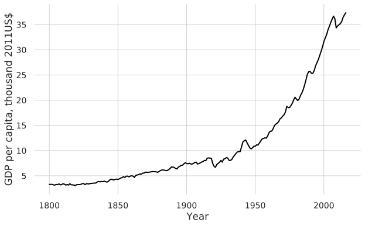
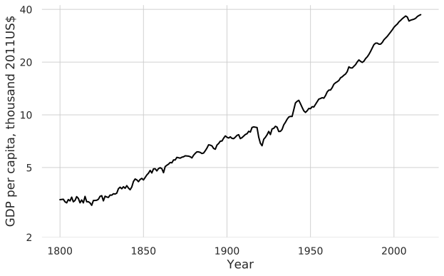
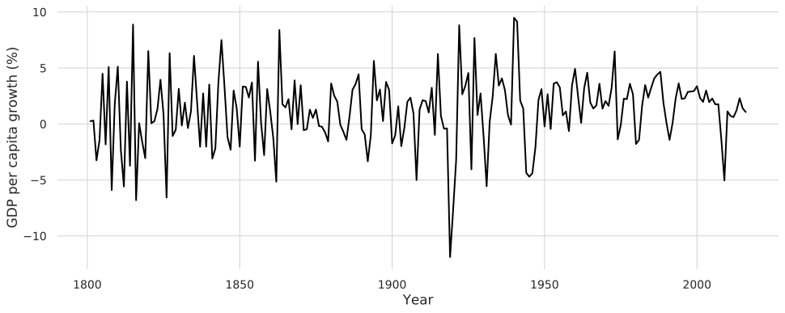
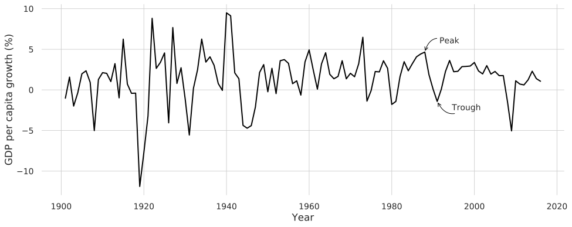
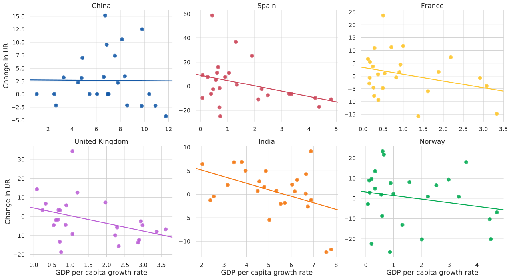
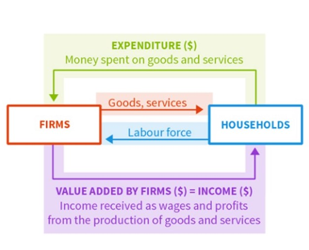
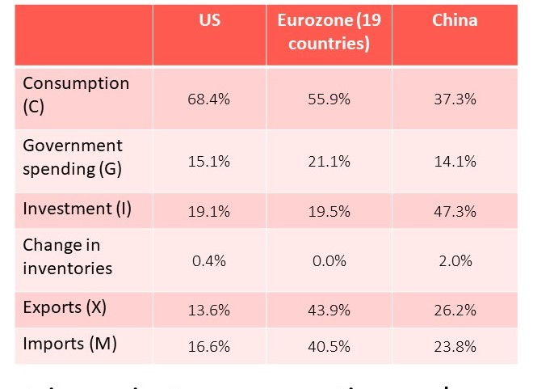

```{r setup, include=FALSE}
options(htmltools.dir.version = FALSE)
library(knitr)
opts_chunk$set(
  fig.align="center", ##fig.width=6, fig.height=4.5, 
  ## out.width="748px", ##out.length="520.75px",
  dpi=300, ##fig.path='Figs/',
  cache=T##, echo=F, warning=F, message=F
  )
```


### This lecture

<br>

<br>


- Measuring the size of an economy: GDP 

- How households smooth fluctuations in their income

- The role of firms’ investment decisions in the business cycle

- Understanding inflation

---
### UK GDP per capita over time

.pull-left[
** Linear scale**

<center>

</center>
]

.pull-right[
** Log scale**
<center>

</center>
]

Data source: Madison Project Database

- UK gdp per capita has grown substantially over the long-run

- The growth has not been smooth
---
### The business cycle


- Business cycle = Alternating periods of positive and negative growth rates.


<center>

</center>

Data source: Madison Project Database

---
### Recession

- Recession = period when output is declining or below its potential level

<center>

</center>

---
### Business cycle and labor market
- Unemployment goes up during recessions

<center>
<iframe src="https://fred.stlouisfed.org/graph/graph-landing.php?g=q5Dh&width=670&height=400" scrolling="no" frameborder="0"style="overflow:hidden; width:670px; height:410px;" allowTransparency="true" loading="lazy"></iframe>
</center>

---
### Okun's law

There is a negative correlation between gdp growth rate and change in unemployment rate

<center>

</center>


---

### Measuring the aggregate economy

.pull-left[

<br>


- National accounts 
 
 - system used to measure overall output and expenditure in a country.

- 3 equivalent ways to measure GDP:

1. Total spending on domestic products

2. Total domestic production (measured as value added)

3. Total domestic income


]

.pull-right[
#### Circular flow model

<center>

</center>
]


---
### Components of GDP


.pull-left[

- Consumption (C)
 
 - Expenditure on consumer goods and services 

- Investment (I) 
 
 - Expenditure on newly produced capital goods (incl. equipment, buildings, and inventories = unsold output) 

- Government spending (G) 
 
 - Government expenditure on goods and services (excluding transfers to avoid double-counting)

- Net exports (trade balance) = Exports (X) minus imports (M)

$$ GDP = C + I + G + X – M $$ 

- (Also known as Y, or aggregate demand) 

]

.pull-right[

<center>

</center>
]

---
### Exports, imports, and government

- How do we account for international transactions?
 
 - e.g. if foreign production is domestic consumption (imports); 
 
 - if or domestic production is foreign consumption (exports)

- We include exports and exclude imports, so that GDP includes value added, income from, or consumption of, domestic production.

- How do we incorporate government?

 - Treat it as another producer – public services are “bought” via taxes

 - Assume that cost of production captures the value added


---
### Summary

- Economic growth is not a smooth process 

 - the economy goes through a business cycle

- System of national accounts to measure the economy

 - GDP = C + I + G + X – M

To revise this lecture and prepare for the next one, read [Unit 13 - Economic Fluctuations and Unemployment](https://core-econ.org/the-economy/book/text/13.html)