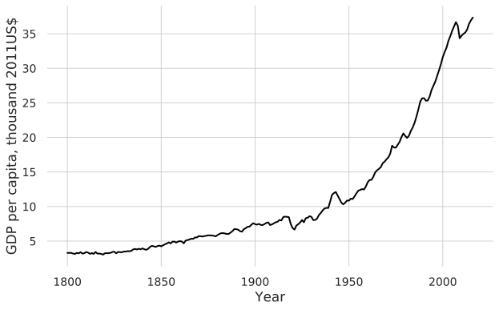
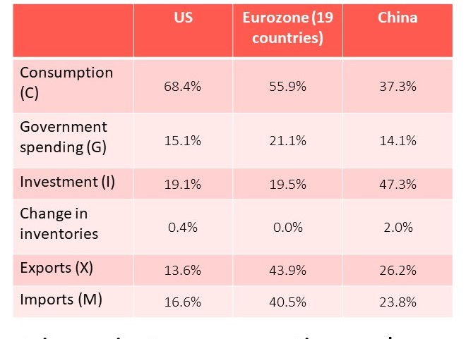
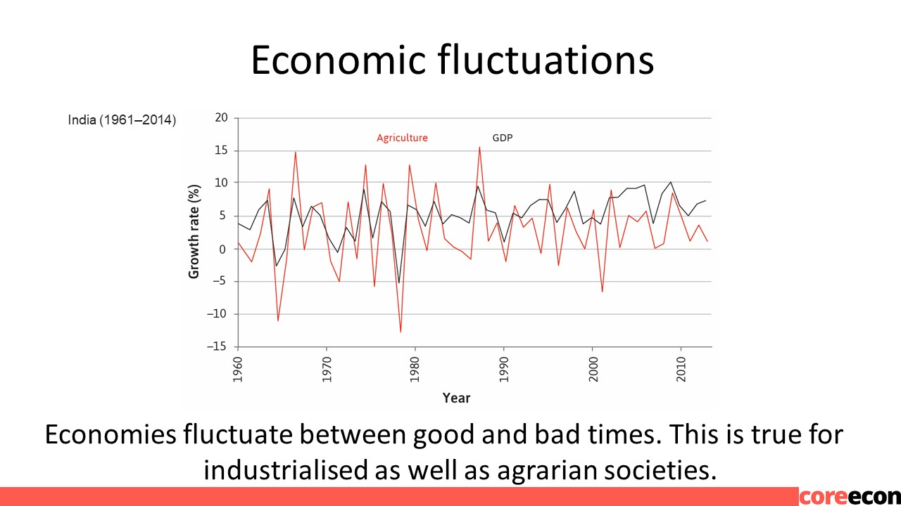
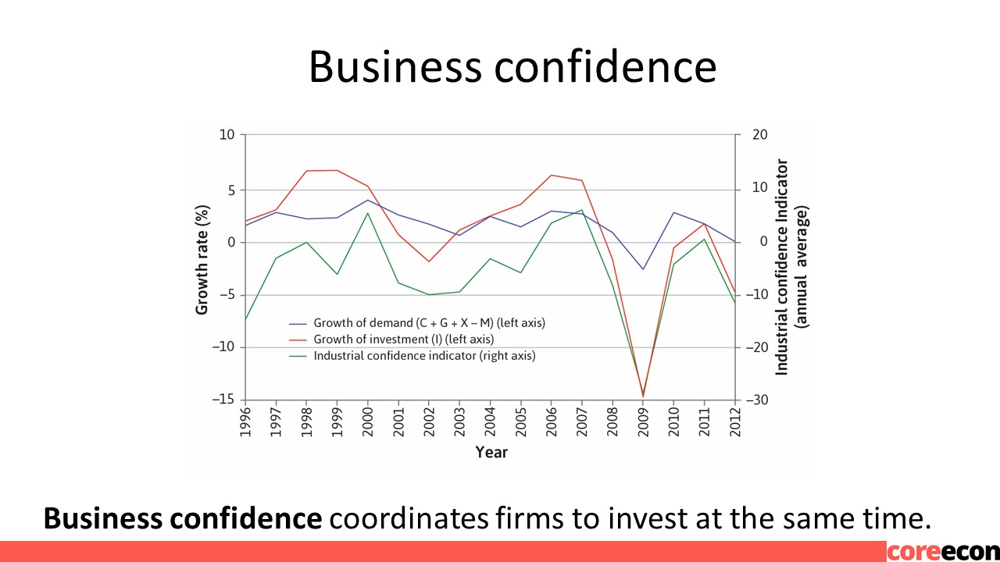
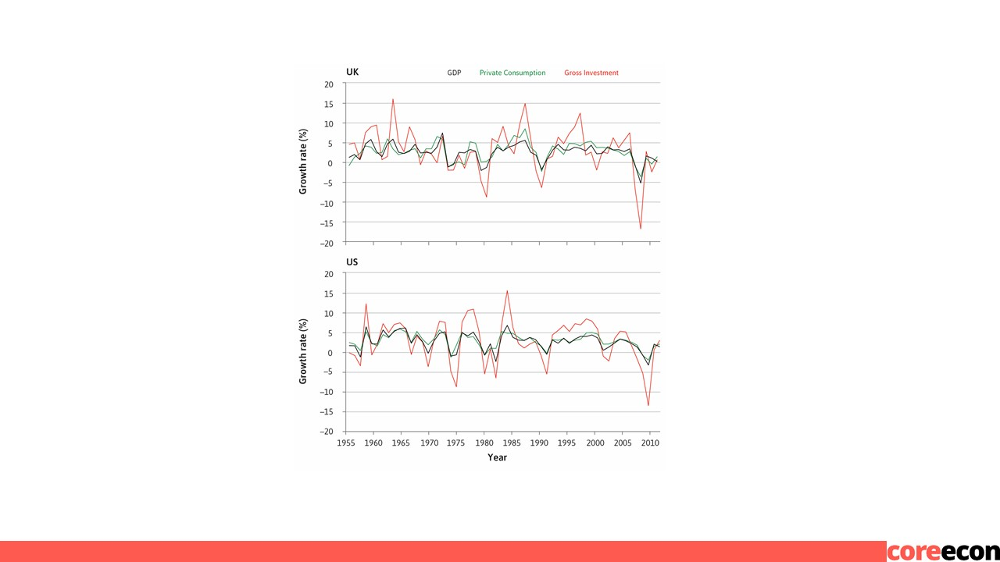
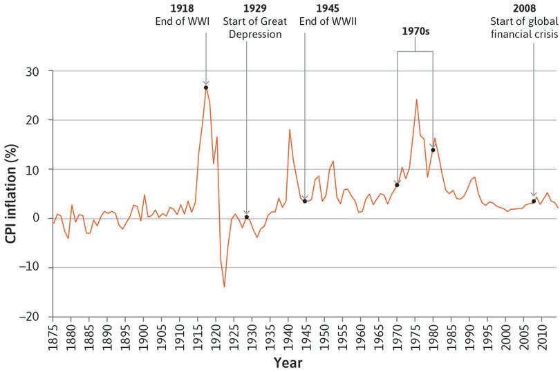

```{r setup, include=FALSE}
options(htmltools.dir.version = FALSE)
library(knitr)
opts_chunk$set(
  fig.align="center", ##fig.width=6, fig.height=4.5, 
  ## out.width="748px", ##out.length="520.75px",
  dpi=300, ##fig.path='Figs/',
  cache=T##, echo=F, warning=F, message=F
  )
```


### This lecture

<br>

<br>


- Measuring the size of an economy: GDP 

- How households smooth fluctuations in their income

- The role of firms’ investment decisions in the business cycle

- Understanding inflation

---
<center>
<iframe src="https://fred.stlouisfed.org/graph/graph-landing.php?g=q5Dh&width=670&height=300" scrolling="no" frameborder="0"style="overflow:hidden; width:670px; height:310px;" allowTransparency="true" loading="lazy"></iframe>
</center>

---
<center>

</center>
---
### The business cycle

.pull-left[

<br>


- Business cycle = Alternating periods of positive and negative growth rates.

- Recession = period when output is declining or below its potential level

- The business cycle affects labour market outcomes.


]

.pull-right[
<center>

</center>
]

---

### Measuring the aggregate economy

.pull-left[

<br>


- National accounts = system used to measure overall output and expenditure in a country.

- 3 equivalent ways to measure GDP:

1. Total spending on domestic products

2. Total domestic production (measured as value added)

3. Total domestic income


]

.pull-right[
<center>

</center>
]

---
### Exports, imports, and government

- How do we account for international transactions?
 
 - e.g. foreign production is domestic consumption (imports); or domestic production is foreign consumption (exports)

- We include exports and exclude imports, so that GDP includes value added, income from, or consumption of, domestic production.

- How do we incorporate government?

 - Treat it as another producer – public services are “bought” via taxes

 - Assume that cost of production captures the value added

---
### Components of GDP


.pull-left[

- Consumption (C)
 
 - Expenditure on consumer goods and services 

- Investment (I) 
 
 - Expenditure on newly produced capital goods (incl. equipment, buildings, and inventories = unsold output) 

- Government spending (G) 
 
 - Government expenditure on goods and services (excluding transfers to avoid double-counting)

- Net exports (trade balance) = Exports (X) minus imports (M)

$$ GDP = C + I + G + X – M $$ 

- (Also known as Y, or aggregate demand) 

]

.pull-right[

<center>

</center>
]

---
### Economic Fluctuations

<center>

</center>

---
### Shocks

- Shock = an unexpected event (such as extreme weather) which causes GDP to fluctuate.


- There are two broad types of shocks:

 - Good or bad fortune strikes the household

 - Good or bad fortune strikes the entire economy


---
### Household shocks

- People use two strategies to deal with shocks that are specific to their household: 

1. Self-insurance – saving and borrowing. Other households are not involved. 

2. Co-insurance – support from social network or government.

- This reflects that households prefer to smooth their consumption, and that they are (to a degree) altruistic.

---
### Economy-wide shocks

- Co-insurance is less effective if the bad shock hits everyone at the same time.

- But when these shocks hit, co-insurance is even more necessary.

- In farming economies of the past that were based in volatile climates, people practised co-insurance based on trust, reciprocity, and altruism.

---
### Smoothing Consumption

.pull-left[

- Households make lifetime consumption plans based on expectations about the future, and react to shocks:

- Readjust long-run consumption (red line) if shocks are permanent

- Do not change long-run consumption if shocks are temporary


]

.pull-right[

<center>

</center>
]

---
### Consumption smoothing and the aggregate economy

- Consumption smoothing is a basic source of stabilisation in an economy.

- Limitations to consumption smoothing mean it cannot always stabilise the economy; it may amplify the initial shock.
 
 - credit constraints, weakness of will, limited co-insurance

- This helps us understand the business cycle and how to manage it. 

---
### Limitations to smoothing: credit constraints

- Credit constraints – limits on amount borrowed/ability to borrow.

- The households unable to adjust to a temporary income shock have lower welfare.

.pull-left[

<center>

</center>
]

.pull-right[

<center>

</center>
]

---
### Limitations to smoothing: weakness of will

.pull-left[

Weakness of will – inability to commit to beneficial future plans.

A household is able to smooth consumption but doesn’t, and may regret it later.
 

]

.pull-right[

<center>

</center>
]

---
### Volatile investment


Firms don’t have preferences for smoothing like households. 
They adjust investment plans to both temporary and permanent shocks, to maximise their profits.  

High demand → high capacity utilisation, →  investment → even higher demand

Investment decisions depend on firms’ expectations about future demand  

---
### Investment: A coordination game

Actors: the two firms

Actions: Invest, or Do not invest

Information: they decide simultaneously

Payoff: profits from investment 

Investment is the best response to other firms’ investment (coordination game).


---
### Business confidence

<center>

</center>


---
### Investment and the aggregate economy 
.pull-left[

The benefits of coordinating investment makes cycles self-reinforcing.
Firms respond positively to the growth of demand in the economy.
This is why investment is more volatile than GDP. 


]

.pull-right[

<center>

</center>
]

---
### Other components of GDP

Government spending is less volatile than investment
     (does not depend on business confidence)

Exports depend on demand from other countries, so will fluctuate according to the business cycles of major export markets.  

---
### Inflation
.pull-left[
Inflation = an increase in the general price level in the economy
Inflation tends to be lower during recessions (high unemployment)

]
.pull-right[

<center>

</center>
]
---
### Trends in inflation

 Upward spikes in inflation during economic crises
 general downward trend since 1970s
 inflation tends to be higher in poor than in rich countries


---
### Measuring inflation

The Consumer Price Index (CPI) measures the general level of prices that consumers have to pay for goods and services, including consumption taxes
Based on a representative bundle of consumer goods – “cost of living”
Common measure of inflation = change in CPI 

GDP deflator = A measure of the level of prices for domestically produced output (ratio of nominal to real GDP) 
Tracks prices of components of GDP (C, I, G, NX)
Allows GDP to be compared across countries and over time

---
### Summary

Economic growth is not a smooth process – the economy goes through a business cycle
Households try to smooth their consumption over the business cycle (problem: credit constraints)
Investment is more volatile than GDP; the outcome of a self-reinforcing coordination game
Inflation moves with the business cycle
System of national accounts to measure the economy
GDP = C + I + G + X – M
Measuring GDP as income, spending, production


